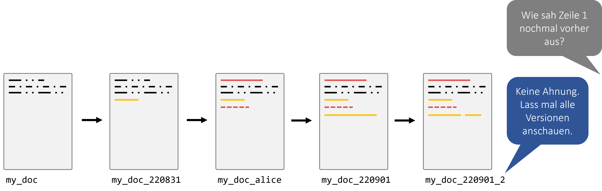
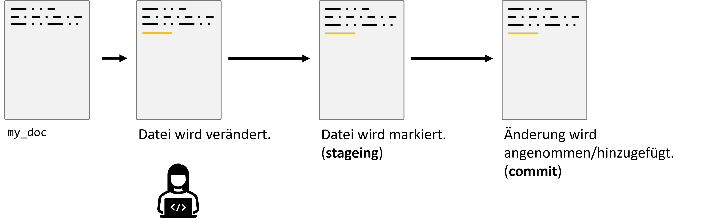
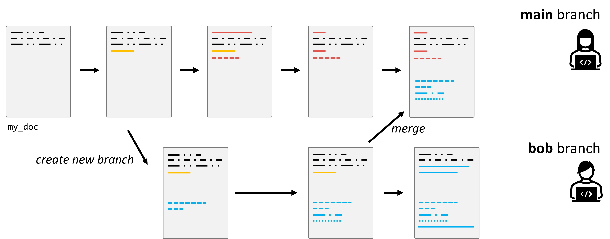

# First Steps in Git: Versionskontrolle verstehen und sicher anwenden

Software verändert sich ständig. Wir beheben Fehler, ergänzen Funktionen, probieren Ideen aus und arbeiten mit anderen Personen am selben Projekt. Ohne Versionskontrolle entstehen dabei schnell Dateinamen wie:

```text
analysis.py
analysis_final.py
analysis_final_v2.py
analysis_final_really_final.py
```

Das funktioniert für sehr kleine Einzelaufgaben manchmal erstaunlich lange. Sobald Projekte wachsen oder mehrere Personen beteiligt sind, wird es aber unübersichtlich: Welche Datei ist aktuell? Welche Änderung hat einen Fehler verursacht? Welche Version soll weitergegeben werden? Und wie lassen sich Änderungen verschiedener Personen zusammenführen?



**Git** löst genau dieses Problem. Git zeichnet die Entwicklung eines Projekts nachvollziehbar auf und erlaubt uns, gezielt festzuhalten, welche Änderungen zusammengehören.

> **Ziel dieses Kapitels:** Ihr sollt das grundlegende Git-Modell **Working Directory → Staging Area → Commit** verstehen und mit `status`, `diff`, `add`, `commit` und `log` sicher arbeiten können.

## Lernziele

Nach diesem Kapitel solltet ihr insbesondere:

- erklären können, warum Versionskontrolle mehr ist als das Speichern mehrerer Dateikopien,
- Git und GitHub voneinander unterscheiden können,
- die Bereiche **Working Tree**, **Staging Area** und **Repository** erklären können,
- ein lokales Repository mit `git init` anlegen können,
- mit `git status` den Zustand eines Repositories lesen können,
- mit `git diff` Änderungen vor einem Commit kontrollieren können,
- Änderungen gezielt mit `git add` für den nächsten Commit auswählen können,
- mit `git commit` nachvollziehbare Speicherpunkte erzeugen können,
- mit `git log` und `git show` die Historie untersuchen können,
- einfache Fehler mit `git restore`, `git restore --staged` und `git revert` sicher korrigieren können,
- die Grundidee von Branches verstehen.

---

# Warum Versionskontrolle?

Versionskontrolle löst mehrere Probleme gleichzeitig.

## Änderungen nachvollziehen

Ein Git-Repository kann zeigen:

- **was** geändert wurde,
- **wann** die Änderung gespeichert wurde,
- **wer** den Commit erstellt hat,
- welche Änderungen gemeinsam als logische Einheit gespeichert wurden.

## Versionen vergleichen

Git kann Unterschiede zwischen Projektständen anzeigen. Dadurch wird zum Beispiel sichtbar, welche Zeile seit dem letzten Commit verändert wurde.

## Fehler untersuchen und Änderungen zurücknehmen

Wenn ein Fehler neu auftritt, lässt sich nachvollziehen, in welchem Commit er eingeführt wurde. Änderungen können außerdem kontrolliert rückgängig gemacht werden.

## Zusammenarbeit ermöglichen

Git wurde für verteilte Zusammenarbeit entwickelt. Mehrere Personen können getrennt arbeiten und ihre Änderungen später zusammenführen.

Branches, Remotes und Pull Requests bauen genau auf den Grundlagen auf, die wir in diesem Kapitel lernen.

## Versionen markieren

Bestimmte Projektstände können später beispielsweise als Releases markiert werden.

---

# Git ist nicht dasselbe wie GitHub

Diese Begriffe werden gerade am Anfang häufig verwechselt.

## Git

**Git** ist das Versionskontrollsystem. Es funktioniert vollständig **lokal** auf eurem Rechner.

Ihr könnt also ein Repository erstellen, Commits anlegen, Unterschiede ansehen und Branches nutzen, ohne GitHub zu verwenden.

## GitHub

**GitHub** ist eine Online-Plattform zum Speichern und gemeinsamen Bearbeiten von Git-Repositories. Ähnliche Plattformen sind beispielsweise GitLab oder Bitbucket.

GitHub ergänzt Git unter anderem um:

- zentrale Remote-Repositories,
- Pull Requests,
- Code Reviews,
- Issues,
- Rechteverwaltung,
- CI/CD-Funktionen.

> In diesem Kapitel konzentrieren wir uns bewusst zuerst auf **lokales Git**. Wenn das lokale Modell verstanden ist, werden Remotes und GitHub sehr viel leichter verständlich.

---

# Versionskontrolle ist kein Backup

Git kann ältere committed Projektstände wiederherstellen. Trotzdem ersetzt ein Git-Repository kein allgemeines Backup-System.

Warum?

- Nicht committed Änderungen sind nicht automatisch geschützt.
- Große Daten, Binärdateien und komplette Festplatten gehören nicht automatisch in Git.
- Ein lokales Repository auf einem beschädigten Datenträger kann zusammen mit den Dateien verloren gehen.
- Versehentlich committed Secrets werden durch Git nicht „sicher“.

Git ist primär ein Werkzeug zur **Versionskontrolle von Projektdateien**, nicht für beliebige Datensicherung.

---

# Das wichtigste mentale Modell

Für den Einstieg brauchen wir drei Bereiche:

```text
Working Tree / Working Directory
            |
            | git add
            v
      Staging Area / Index
            |
            | git commit
            v
      Local Git Repository
```

Oder kurz:

```text
ändern  ->  auswählen  ->  speichern
           git add        git commit
```

## 1. Working Tree

Der **Working Tree** enthält die Dateien, mit denen ihr gerade arbeitet.

Ihr öffnet eine Datei im Editor, verändert Code, erstellt eine neue Datei oder löscht etwas. Diese Änderungen befinden sich zunächst nur in eurem Arbeitsverzeichnis.

## 2. Staging Area

Die **Staging Area**, technisch auch **Index**, ist die Auswahl für den **nächsten Commit**.

Mit

```bash
git add <datei>
```

sagt ihr nicht einfach nur „Git soll diese Datei kennen“, sondern genauer:

> „Nimm den aktuellen Stand dieser Änderung in die Auswahl für meinen nächsten Commit auf.“

Das ist wichtig, weil ihr dadurch entscheiden könnt, **welche Änderungen zusammen in einen Commit gehören**.

## 3. Repository

Mit

```bash
git commit
```

wird aus dem Inhalt der Staging Area ein Commit in der lokalen Git-Historie.

Diese Informationen speichert Git im versteckten Verzeichnis:

```text
.git/
```


---

# Git denkt in Snapshots

Git wird manchmal vereinfacht als System beschrieben, das nur „Unterschiede zwischen Dateien“ speichert. Für das Verständnis der täglichen Arbeit ist ein anderes Modell hilfreicher:

> Ein Commit beschreibt einen **Snapshot des Projekts** zu einem bestimmten Zeitpunkt.

Intern arbeitet Git sehr effizient und speichert Inhalte nicht unnötig mehrfach. Für uns als Nutzer:innen ist aber entscheidend:

- ein Commit ist ein definierter Projektstand,
- Commits sind miteinander verbunden,
- aus diesen Commits entsteht die Projektgeschichte.

---

# Git installieren und prüfen

Ob Git verfügbar ist, prüft ihr mit:

```bash
git --version
```

Eine Ausgabe könnte beispielsweise so aussehen:

```text
git version 2.x.x
```

Die genaue Versionsnummer ist für die Übungen meist nicht wichtig. Entscheidend ist, dass Git korrekt gefunden wird.

---

# Git einmalig konfigurieren

Git speichert bei jedem Commit unter anderem Name und E-Mail-Adresse des Commit-Autors.

Einmalige globale Konfiguration:

```bash
git config --global user.name "Alice Example"
git config --global user.email "alice@example.com"
```

Den Standardnamen für neue Hauptbranches können wir auf `main` setzen:

```bash
git config --global init.defaultBranch main
```

Einstellungen ansehen:

```bash
git config --list
```

Oder gezielt:

```bash
git config --global user.name
git config --global user.email
```

> Verwendet für echte Projekte eine E-Mail-Adresse, die ihr bewusst mit euren Commits verknüpfen möchtet. Für Kursübungen kann je nach Vorgabe auch eine Hochschuladresse verwendet werden.

---

# Ein erstes Repository erstellen

Wir verwenden als Beispiel ein kleines Rezept-Projekt.

```bash
mkdir recipes
cd recipes
```

Kontrolle:

```bash
pwd
ls
```

Jetzt initialisieren wir Git:

```bash
git init
```

Danach:

```bash
git status
```

Mit

```bash
ls -la
```

wird außerdem der neue versteckte Ordner sichtbar:

```text
.git
```

> Der `.git/`-Ordner macht aus einem normalen Verzeichnis ein Git-Repository. Löscht ihr `.git/`, verliert dieses Verzeichnis seine lokale Git-Historie und Repository-Metadaten.

---

# `git status`: Der wichtigste Diagnosebefehl

Wenn ihr in Git nicht sicher seid, was gerade passiert, ist

```bash
git status
```

fast immer der beste erste Befehl.

`git status` zeigt unter anderem:

- auf welchem Branch ihr seid,
- welche Dateien **untracked** sind,
- welche Dateien verändert wurden,
- welche Änderungen bereits gestaged sind,
- ob das Working Tree sauber ist.

Wir werden `git status` deshalb während der gesamten Session immer wieder verwenden.

> **Merksatz:** In Git ist es selten falsch, zuerst `git status` auszuführen.

---

# Untracked Files

Erstellt eine erste Datei:

```bash
touch guacamole.md
```

Fügt beispielsweise folgenden Inhalt über euren Editor ein:

```markdown
# Guacamole

## Ingredients
- avocado
- lime
- salt

## Instructions
Mash and mix.
```

Danach:

```bash
git status
```

Git wird die Datei als **untracked** anzeigen.

Das bedeutet:

> Die Datei existiert im Working Tree, gehört aber noch nicht zu einem Commit und ist aktuell nicht für den nächsten Commit ausgewählt.

---

# Änderungen ansehen: `git diff`

Bei bereits von Git verfolgten Dateien zeigt

```bash
git diff
```

Änderungen im Working Tree an, die **noch nicht in der Staging Area** liegen.

Das ist einer der wichtigsten Befehle für sauberes Arbeiten:

> **Vor dem Commit lesen, was tatsächlich geändert wurde.**

## Warum zeigt `git diff` eine neue untracked Datei nicht vollständig an?

Eine komplett neue, untracked Datei ist noch nicht Teil des von Git verfolgten Projektzustands. Der normale `git diff` vergleicht vor allem bereits bekannte Inhalte zwischen Working Tree und Staging Area.

Sobald eine neue Datei gestaged wurde, kann ihr geplanter Inhalt mit

```bash
git diff --staged
```

betrachtet werden.

---

# Staging: `git add`

Wir wählen `guacamole.md` für den nächsten Commit aus:

```bash
git add guacamole.md
```

Danach sofort wieder:

```bash
git status
```

Git zeigt nun die Datei unter **Changes to be committed**.

Jetzt ist ein guter Zeitpunkt für:

```bash
git diff --staged
```

Dieser Befehl zeigt:

> Welche Änderung würde in den nächsten Commit eingehen, wenn ich jetzt `git commit` ausführe?

Das ist eine sehr hilfreiche Kontrollfrage.

---

# `git add` bedeutet nicht „für immer hinzufügen“

Gerade Einsteiger:innen interpretieren `git add` oft so:

> „Ab jetzt kennt Git diese Datei.“

Das ist nicht völlig falsch, aber unvollständig.

Bei jeder weiteren Änderung an einer bereits getrackten Datei muss der gewünschte neue Stand erneut gestaged werden.

Beispiel:

```bash
echo "Serve immediately." >> guacamole.md
git status
```

Die Datei ist zwar bereits getrackt, aber die neue Änderung ist noch **nicht gestaged**.

Darum ist die bessere Bedeutung von `git add`:

> **Nimm diesen aktuellen Stand in den nächsten Commit auf.**

---

# Der erste Commit

Wenn die Staging Area korrekt aussieht:

```bash
git commit -m "Add basic guacamole recipe"
```

Danach:

```bash
git status
```

Idealerweise erscheint nun sinngemäß:

```text
nothing to commit, working tree clean
```

Das bedeutet:

- keine uncommitted Änderungen,
- keine neuen untracked Dateien,
- Working Tree und letzter Commit passen zusammen.

---

# Was ist ein guter Commit?

Ein Commit sollte eine **logische Änderungseinheit** darstellen.

Gute Commits sind typischerweise:

- klein genug, um verstanden zu werden,
- in sich sinnvoll,
- möglichst unabhängig reviewbar,
- mit einer beschreibenden Nachricht versehen.

## Gute Commit-Nachrichten

Besser:

```text
Add input validation for empty names
```

```text
Fix CSV parsing for missing values
```

```text
Add basic guacamole recipe
```

Weniger hilfreich:

```text
stuff
```

```text
changes
```

```text
final
```

Eine gute Commit-Nachricht beschreibt möglichst klar, **was dieser Commit bewirkt**.

---

# Die Historie ansehen: `git log`

```bash
git log
```

zeigt die Commit-Historie ausführlich an.

Für den Alltag ist häufig diese kompakte Form praktischer:

```bash
git log --oneline
```

Eine etwas grafischere Variante:

```bash
git log --oneline --graph --decorate
```

Später bei Branches ist außerdem nützlich:

```bash
git log --oneline --graph --decorate --all
```

---

# Einen Commit genauer ansehen: `git show`

Den aktuellsten Commit anzeigen:

```bash
git show HEAD
```

Den Commit davor:

```bash
git show HEAD~1
```

Einen bestimmten Commit über seine ID:

```bash
git show <commit-id>
```

Git-Commit-IDs sind lang, aber häufig reichen die ersten eindeutig identifizierenden Zeichen.

---

# Änderungen machen und kontrollieren

Ergänzt eine neue Zutat:

```bash
echo "- tomato" >> guacamole.md
```

Dann:

```bash
git status
git diff
```

Jetzt sehen wir die Änderung **vor** dem Staging.

Wenn sie korrekt ist:

```bash
git add guacamole.md
git diff --staged
git commit -m "Add tomato to guacamole ingredients"
```

Damit entsteht der Kernzyklus:

```text
edit
  |
  v
git status
  |
  v
git diff
  |
  v
git add
  |
  v
git diff --staged
  |
  v
git commit
```

---

# Eine Datei kann gleichzeitig staged und unstaged sein

Das ist einer der wichtigsten Git-Momente für das Verständnis der Staging Area.

Zuerst eine Änderung erzeugen:

```bash
echo "Serve immediately." >> guacamole.md
```

Dann stagen:

```bash
git add guacamole.md
```

Jetzt noch **eine weitere** Änderung an derselben Datei:

```bash
echo "Optional: add chili." >> guacamole.md
```

Nun:

```bash
git status
```

Die gleiche Datei kann jetzt gleichzeitig erscheinen als:

- Änderung in der Staging Area,
- weitere Änderung im Working Tree.

Vergleicht:

```bash
git diff
```

mit:

```bash
git diff --staged
```

Damit wird klar:

> Git staged nicht einfach „die Datei als Konzept“, sondern den konkreten ausgewählten Stand ihrer Inhalte.

---

# Nicht jede Änderung gehört in denselben Commit

Angenommen, ihr habt gleichzeitig:

- einen Fehler im Parser behoben,
- eine README erweitert,
- eine Debug-Datei erzeugt.

Dann wäre

```bash
git add .
```

zwar bequem, könnte aber unabsichtlich alles gemeinsam stagen.

Gerade beim Lernen ist häufig besser:

```bash
git add parser.py
git add tests/test_parser.py
```

und danach:

```bash
git diff --staged
```

So bleibt klar, **warum genau diese Änderungen in einem Commit landen**.

`git add .` ist nicht grundsätzlich falsch. Man sollte nur vorher wissen, welche Änderungen im aktuellen Verzeichnis liegen.

---

# `.gitignore`: Was soll Git ignorieren?

Nicht jede Datei eines Python-Projekts gehört in die Versionskontrolle.

Typische Beispiele:

```gitignore
.venv/
__pycache__/
.pytest_cache/
.ruff_cache/
build/
dist/
```

Diese Einträge können in einer Datei namens

```text
.gitignore
```

stehen.

Git behandelt passende untracked Dateien dann nicht mehr als normale Kandidaten für Commits.

## Was gehört typischerweise hinein?

Häufig ignoriert werden:

- virtuelle Umgebungen,
- Python-Cache-Dateien,
- temporäre Test-/Linting-Caches,
- generierte Build-Artefakte,
- lokale IDE-/OS-Dateien, wenn sie projektweit nicht sinnvoll sind.

## Was gehört **nicht** hinein?

Quellcode und wichtige Projektkonfigurationen sollten natürlich versioniert werden.

Für unsere `uv`-Projekte gilt insbesondere:

> `uv.lock` wird im Kurs **committed**.

Das Lockfile hilft dabei, Abhängigkeiten reproduzierbar festzuhalten.

---

# Keine Secrets committen

Passwörter, API-Keys, private Tokens oder andere Geheimnisse gehören **nicht** in Git.

Beispiele problematischer Dateien oder Inhalte:

```text
API_KEY="..."
password="..."
private_token="..."
```

Auch wenn ein Secret später wieder aus einer Datei gelöscht wird, kann es bereits in älteren Commits vorhanden sein.

> Git ist hervorragend darin, Geschichte zu bewahren. Genau deshalb ist es schlecht, versehentlich eingecheckte Geheimnisse einfach nur in einem späteren Commit zu löschen.

Für Secrets werden später andere Mechanismen verwendet, beispielsweise Umgebungsvariablen oder Secret-Stores.

---

# Große Daten und Git

Quellcode ist meist klein und textbasiert – ideal für Git.

Große Binärdateien oder umfangreiche Rohdatensätze sind dagegen oft ungeeignet für ein normales Git-Repository.

Darum sollte bei Data-Science-Projekten bewusst entschieden werden:

- Was ist **Code und Konfiguration**?
- Was sind **kleine Beispieldaten**, die sinnvoll ins Repository gehören?
- Was sind **große Daten**, die getrennt gespeichert werden sollten?

---

# Änderungen sicher zurücknehmen

Git bietet mehrere Möglichkeiten, Änderungen rückgängig zu machen. Entscheidend ist immer die Frage:

> Wo befindet sich die Änderung gerade?

- nur im Working Tree?
- bereits in der Staging Area?
- bereits in einem Commit?
- wurde der Commit schon mit anderen geteilt?

---

## Fall 1: Nicht gestagte Änderung verwerfen

```bash
git restore guacamole.md
```

Dadurch wird die nicht gestagte Working-Tree-Änderung verworfen.

> **Achtung:** Nicht gespeicherte Änderungen können dabei verloren gehen.

Vorher besser:

```bash
git diff
```

und prüfen, was tatsächlich verschwinden würde.

---

## Fall 2: Datei aus der Staging Area nehmen

```bash
git restore --staged guacamole.md
```

Die Datei wird **unstaged**, aber die Änderung bleibt im Working Tree erhalten.

Danach:

```bash
git status
git diff
```

Das ist sehr nützlich, wenn versehentlich die falsche Datei für den nächsten Commit ausgewählt wurde.

---

## Fall 3: Einen bereits committed Stand rückgängig machen

Für Änderungen in einer veröffentlichten bzw. gemeinsam genutzten Historie ist häufig `git revert` der sicherste Einstieg:

```bash
git revert <commit-id>
```

`git revert` löscht den alten Commit nicht. Stattdessen wird ein **neuer Commit** erzeugt, der dessen Änderung rückgängig macht.

Damit bleibt die Historie nachvollziehbar.

---

# Vorsicht mit `git reset`

`git reset` ist ein mächtiger Befehl und kann je nach Option:

- die Staging Area verändern,
- Branch-Zeiger verschieben,
- lokale Historie umschreiben,
- bei `--hard` zusätzlich Working-Tree-Änderungen löschen.

Darum gilt für den Einstieg:

> Wenn ihr nicht erklären könnt, was `git reset --hard` mit **HEAD**, **Index** und **Working Tree** macht, verwendet es nicht für wichtige Arbeit.

Für die typischen Einsteigerfälle reichen zunächst meist:

```bash
git restore <file>
git restore --staged <file>
git revert <commit>
```

---

# Branches: Eine erste Erweiterung des Modells

Bis hierhin sah unsere Geschichte ungefähr so aus:

```text
A -- B -- C
```

Ein **Branch** ist ein beweglicher Name, der auf einen Commit zeigt. Dadurch können parallele Entwicklungslinien entstehen.

Zum Beispiel:

```text
A -- B -- C  main
          \
           D -- E  add-salsa-recipe
```

Branches sind nützlich, um:

- eine neue Funktion zu entwickeln,
- einen Bugfix getrennt umzusetzen,
- Experimente auszuprobieren,
- Teamarbeit zu strukturieren.



## Branches anzeigen

```bash
git branch
```

## Neuen Branch erstellen und direkt wechseln

```bash
git switch -c add-salsa-recipe
```

`-c` steht hier für *create*.

## Zurück zu `main`

```bash
git switch main
```

Ältere Tutorials verwenden dafür häufig `git checkout`. Der moderne Befehl `git switch` trennt den Branch-Wechsel klarer von Datei-Wiederherstellung, für die `git restore` verwendet wird.

---

# Einen Branch mergen

Wenn die Änderung fertig ist, kann sie in einen anderen Branch integriert werden.

Beispiel lokal:

```bash
git switch main
git merge add-salsa-recipe
```

Im späteren Teamworkflow wird derselbe konzeptionelle Schritt häufig über einen **Pull Request auf GitHub** erfolgen.

---

# Merge-Konflikte

Git kann viele Änderungen automatisch kombinieren. Manchmal wurden aber inkompatible Änderungen an derselben Stelle vorgenommen.

Dann entstehen Konfliktmarker wie:

```text
<<<<<<< HEAD
current version
=======
other version
>>>>>>> feature-branch
```

Ein Merge-Konflikt bedeutet nicht, dass Git „kaputt“ ist. Git sagt lediglich:

> „Ich kann nicht sicher entscheiden, welche Endfassung gemeint ist.“

Typisches Vorgehen:

1. Inhalt beider Varianten verstehen.
2. Gewünschte Endfassung herstellen.
3. Konfliktmarker entfernen.
4. Datei testen bzw. prüfen.
5. Gelöste Datei stagen.
6. Merge abschließen.

Beispiel:

```bash
git add resolved_file.py
git commit
```

---

# Git und automatisierte Tools

In Softwareprojekten wird Git fast nie isoliert verwendet.

Ein typischer lokaler Ablauf kann später so aussehen:

```bash
git status
git diff
uv run pytest
uv run ruff check .
git add src/my_module.py tests/test_my_module.py
git diff --staged
git commit -m "Handle missing values in parser"
```

Damit werden zwei zentrale Ideen verbunden:

- **Änderungen kontrollieren** mit Git,
- **Verhalten prüfen** mit automatisierten Tools.

---

# Git und KI-generierter Code

Gerade wenn Code mit KI-Unterstützung erzeugt oder verändert wird, werden Git-Diffs besonders wichtig.

Eine sinnvolle Reihenfolge ist:

```text
1. kleine Aufgabe definieren
2. Änderung erzeugen
3. git diff lesen
4. Tests/Linter ausführen
5. gezielt stagen
6. git diff --staged lesen
7. committen
```

Dabei bleibt die Verantwortung bei euch:

> Ein erzeugter Codeblock sollte nicht allein deshalb committed werden, weil er syntaktisch plausibel aussieht.

Git hilft dabei, Änderungen sichtbar und reviewbar zu machen.

---

# Ein sinnvoller täglicher Minimal-Workflow

Für lokale Arbeit reicht häufig dieser Kern:

```bash
git status

# Dateien bearbeiten

git diff

# optional, aber sehr sinnvoll:
uv run pytest
uv run ruff check .

git add <files>
git diff --staged
git commit -m "Describe the change"
git status
```

Sobald ihr mit Branches arbeitet:

```bash
git switch -c issue-42-short-description
```

vor der eigentlichen Änderung.

---

# Kleine Übung

Erstellt ein neues Repository `favorite-food`.

1. Legt das Verzeichnis an.
2. Initialisiert Git.
3. Erstellt `README.md`.
4. Schreibt einen Titel und einen kurzen Satz hinein.
5. Führt `git status` aus.
6. Staged die Datei.
7. Kontrolliert mit `git diff --staged`.
8. Erstellt den ersten Commit.
9. Ergänzt eine zweite Zeile.
10. Kontrolliert die Änderung mit `git diff`.
11. Erstellt einen zweiten Commit.
12. Betrachtet die Historie mit `git log --oneline`.

Zusatz:

13. Erzeugt eine Änderung, staged sie und verändert danach dieselbe Datei erneut.
14. Vergleicht `git diff` und `git diff --staged`.

---

# Cheat Sheet: Git für Übungen und Praktikum

Dieses Cheat Sheet enthält bewusst mehr als das absolute Minimum der ersten Session.

## Die fünf Kernbefehle

Wenn ihr am Anfang nur fünf Git-Befehle wirklich sicher beherrscht, dann diese:

```bash
git status
git diff
git add
git commit
git log
```

## Repository und Konfiguration

| Aufgabe | Befehl | Hinweis |
|---|---|---|
| Git-Version prüfen | `git --version` | Installation testen |
| Einstellungen anzeigen | `git config --list` | globale + lokale Konfiguration |
| Namen setzen | `git config --global user.name "Name"` | einmalig pro Rechner |
| E-Mail setzen | `git config --global user.email "mail@example.com"` | Commit-Autor |
| Standardbranch setzen | `git config --global init.defaultBranch main` | für neue Repositories |
| Repository initialisieren | `git init` | erstellt `.git/` |

## Zustand prüfen

| Aufgabe | Befehl | Hinweis |
|---|---|---|
| Repository-Zustand | `git status` | wichtigster Diagnosebefehl |
| Kurzer Status | `git status -s` | kompakte Ausgabe |
| Aktuelle Branches | `git branch` | `*` markiert aktuellen Branch |

## Unterschiede ansehen

| Aufgabe | Befehl | Was wird verglichen? |
|---|---|---|
| Nicht gestagte Änderungen | `git diff` | Working Tree vs. Staging Area |
| Gestagte Änderungen | `git diff --staged` | Staging Area vs. letzter Commit |
| Bestimmte Datei | `git diff -- path/to/file.py` | Diff auf Datei begrenzen |
| Zwei Commits vergleichen | `git diff <a> <b>` | Historienstände vergleichen |
| Commit ansehen | `git show <commit>` | Inhalt und Metadaten |
| Aktuellsten Commit ansehen | `git show HEAD` | `HEAD` = aktueller Commit |

## Staging

| Aufgabe | Befehl | Hinweis |
|---|---|---|
| Eine Datei stagen | `git add file.py` | gezielt und gut nachvollziehbar |
| Mehrere Dateien stagen | `git add file1.py file2.py` | gemeinsamer Commit |
| Aktuelles Verzeichnis stagen | `git add .` | vorher `git status` prüfen |
| Datei wieder unstage | `git restore --staged file.py` | Änderung bleibt im Working Tree |

## Committen

| Aufgabe | Befehl | Hinweis |
|---|---|---|
| Commit mit Nachricht | `git commit -m "Message"` | committed nur gestagte Inhalte |
| Commit im Editor beschreiben | `git commit` | für längere Nachricht |
| Danach prüfen | `git status` | sollte oft clean sein |

## Historie

| Aufgabe | Befehl | Hinweis |
|---|---|---|
| Ausführliche Historie | `git log` | Autor, Datum, Hash, Nachricht |
| Kompakte Historie | `git log --oneline` | sehr häufig praktisch |
| Graphische Kurzansicht | `git log --oneline --graph --decorate` | Branch-Struktur sichtbar |
| Alle Branches im Graph | `git log --oneline --graph --decorate --all` | gute Übersicht |
| Vorheriger Commit | `HEAD~1` | ein Schritt zurück |
| Zwei Commits zurück | `HEAD~2` | zwei Schritte zurück |

## Änderungen zurücknehmen

| Situation | Befehl | Effekt |
|---|---|---|
| Nicht gestagte Datei verwerfen | `git restore file.py` | Working-Tree-Änderung weg |
| Datei unstage | `git restore --staged file.py` | Änderung bleibt lokal |
| Commit nachvollziehbar rückgängig machen | `git revert <commit>` | neuer Gegen-Commit |
| Historie umschreiben | `git reset ...` | **fortgeschritten / vorsichtig** |

## Branches

| Aufgabe | Befehl | Hinweis |
|---|---|---|
| Branches anzeigen | `git branch` | lokales Repository |
| Branch erstellen + wechseln | `git switch -c feature-name` | moderner Einstieg |
| Branch wechseln | `git switch main` | Working Tree wird angepasst |
| Zum vorherigen Branch | `git switch -` | schneller Wechsel |
| Branch lokal mergen | `git merge feature-name` | aus Zielbranch ausführen |
| Gemergten Branch löschen | `git branch -d feature-name` | verweigert riskantes Löschen |

## Dateien ignorieren

`.gitignore`-Beispiel für Python:

```gitignore
.venv/
__pycache__/
.pytest_cache/
.ruff_cache/
build/
dist/
```

Typischerweise **committen**:

```text
src/
tests/
README.md
pyproject.toml
uv.lock
.gitignore
```

Typischerweise **nicht committen**:

```text
.venv/
__pycache__/
private API keys
passwords
secrets
sehr große Rohdaten ohne guten Grund
```

## Diagnose-Reihenfolge bei Git-Problemen

Wenn etwas unklar ist:

```bash
git status
git diff
git diff --staged
git log --oneline --graph --decorate --all
```

Diese vier Befehle erklären einen erstaunlich großen Teil typischer Anfängerprobleme.

## Minimaler Qualitätscheck vor einem Commit

```bash
git status
git diff
uv run pytest
uv run ruff check .
git add <files>
git diff --staged
git commit -m "Meaningful message"
git status
```

> **Merksatz:** Ein Commit sollte nicht überraschen. Vor `git commit` solltet ihr mit `git diff --staged` ungefähr genau wissen, was gespeichert wird.

---

# Weiterführende Quellen

- Offizielle Git-Dokumentation: <https://git-scm.com/docs>
- Pro Git Book: <https://git-scm.com/book/en/v2>
- Git `status`: <https://git-scm.com/docs/git-status>
- Git `diff`: <https://git-scm.com/docs/git-diff>
- Git `add`: <https://git-scm.com/docs/git-add>
- Git `commit`: <https://git-scm.com/docs/git-commit>
- Git `switch`: <https://git-scm.com/docs/git-switch>
- Git `restore`: <https://git-scm.com/docs/git-restore>
- Software Carpentry Git Novice: <https://swcarpentry.github.io/git-novice/>

Für zusätzliche einsteigerfreundliche Erklärungen sind außerdem die bereits im Kursmaterial verwendeten Git-Guides von Atlassian und W3Schools gut zum Nachschlagen geeignet.
