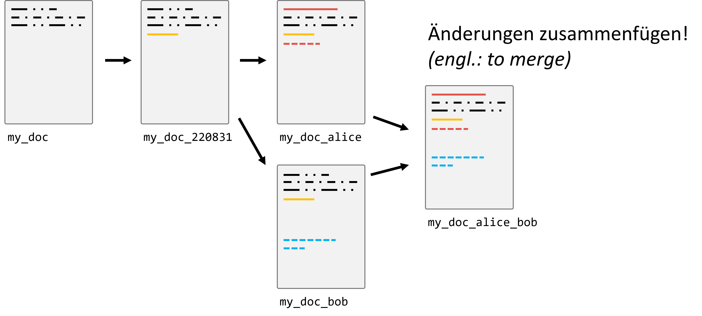
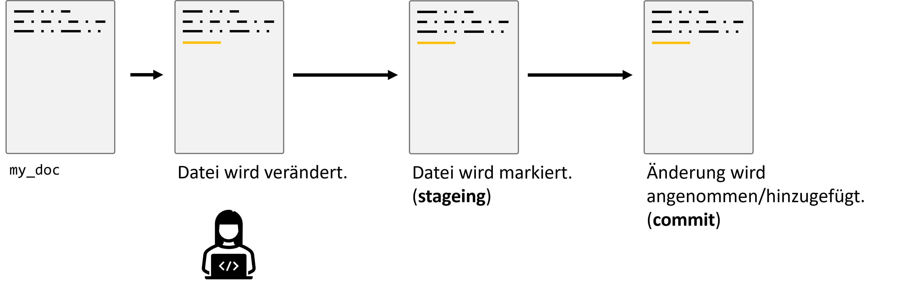

# Versionskontrolle mit Git

## Motivation

Sicherlich erinnert sich jeder an Zeiten, in denen man an einem größeren Dokument oder Programmcode arbeitete und unterschiedliche Versionen unter diversen Namen speicherte: "Projekt_Final", "Projekt_Final_v2", "Projekt_EchtJetztFinal". Das mag auf den ersten Blick praktikabel erscheinen, insbesondere wenn man allein an einem Projekt arbeitet. 
(Und, keine Sorge, das hat jede/r von uns schon so gemacht!)

Doch die Realität zeigt, dass diese Methode zahlreiche Fallstricke birgt:

1. **Unübersichtlichkeit**: Schnell sammeln sich viele Dateiversionen an, und es wird zunehmend schwerer, den Überblick zu behalten.
2. **Verwirrung**: Es ist unklar, welche Änderungen in welcher Dateiversion vorgenommen wurden, vor allem wenn klare Benennungskonventionen fehlen.
3. **Teamarbeit**: In Projekten, in denen mehrere Personen beteiligt sind, wird dieser Ansatz rasch unpraktikabel. Wie stellt man sicher, dass jeder Zugriff auf die neueste Version hat? Wie kombiniert man die Änderungen mehrerer Personen?

Der letzte Punkt ist besonders problematisch, wenn Teammitglieder asynchron arbeiten, d.h., nicht gleichzeitig oder an verschiedenen Orten. Das manuelle Zusammenführen (oder "Mergen") von Dateien kann zu Fehlern führen, Überschneidungen verursachen und ist sehr zeitaufwändig. Einige Änderungen könnten sogar verloren gehen oder überschrieben werden.


Hier kommt die Versionskontrolle ins Spiel! Sie stellt eine elegante Lösung für diese Herausforderungen dar und ermöglicht es Einzelpersonen und Teams, effizienter und fehlerfreier zu arbeiten.




## Warum Versionskontrolle (version control)?

Die Versionskontrolle ermöglicht es uns, den Verlauf und die Entwicklung eines Projekts zu verfolgen und zu steuern. Zu den Hauptvorteilen gehören:

- **Aufzeichnen von Änderungen**: Sie können genau sehen, welche Änderungen wann und von wem vorgenommen wurden.
- **Vergleich von Versionen**: Wenn Sie wissen wollen, was zwischen zwei Versionen geändert wurde, können Sie das einfach herausfinden.
- **Einfaches Teilen**: Sie können Ihre Arbeit mit anderen teilen, und diese können ihre Änderungen mit Ihnen teilen.
- **Mergen von Änderungen**: Kombinieren Sie die Arbeit von mehreren Personen in einem zentralen Projekt.
- **Tags für Releases**: Markieren Sie bestimmte Punkte in der Geschichte Ihres Projekts als offizielle Releases oder Versionen.
- **Experimentieren ohne Risiko**: Mit Branches können Sie neue Ideen ausprobieren, ohne die Hauptversion Ihres Projekts zu beeinflussen.
- **Industriestandard**: Fast alle professionellen Software- und Datenprojekte verwenden eine Art von Versionskontrolle.

**Achtung:** Es ist wichtig zu betonen, dass Versionskontrolle **nicht dasselbe ist wie ein Backup**. Obwohl Sie zu früheren Versionen zurückkehren können, ersetzt dies nicht die Notwendigkeit von Backups für Datenverlustszenarien.


## Einführung in Git

Git wurde 2005 von Linus Torvalds initiiert, ursprünglich als Werkzeug zur Versionskontrolle für die Entwicklung des Linux-Kernels. Es hat sich jedoch schnell zu einem der am weitesten verbreiteten Versionskontrollsysteme weltweit entwickelt und ist heute der Standard im Software- und IT-Bereich.

### Ziele von Git

Git wurde mit einigen zentralen Zielen im Hinterkopf entwickelt, darunter:

- **Sicherheit**: Jede Änderung wird sicher und nachvollziehbar gespeichert, sodass der gesamte Verlauf der Änderungen lückenlos dokumentiert ist.
- **Effizienz**: Git ist darauf optimiert, effizient auch mit großen Projekten und vielen Änderungen zu arbeiten.

### Komplex, aber nur das Nötigste

Obwohl Git sehr mächtig und komplex ist, benötigen die meisten Benutzer*innen nur eine Handvoll grundlegender Funktionen. Diese Kernfunktionen ermöglichen es, Git produktiv zu nutzen, ohne sich mit den tieferen technischen Details auseinandersetzen zu müssen.

### Der Standard in der Softwareentwicklung

In der heutigen Softwareentwicklung ist Git das zentrale Werkzeug für Versionskontrolle. Andere Systeme spielen in der Praxis kaum noch eine Rolle und werden in professionellen Umgebungen selten verwendet. Das bedeutet, dass Git-Kenntnisse in den meisten IT-Berufen und Softwareprojekten unerlässlich sind.

## Wie funktioniert Git?

Git speichert nicht einfach vollständige Kopien von Dateien. Stattdessen konzentriert es sich auf die Unterschiede, die sogenannten "Deltas", zwischen verschiedenen Versionen von Dateien. Dies macht Git besonders effizient, da nur die Änderungen gespeichert werden und nicht jede Datei komplett neu.


## Grundlegender Prozess

Der grundlegende Git-Workflow basiert auf einem einfachen Zyklus von Änderungen, der sich in drei Phasen unterteilt:

- **Staging**: Hier werden die Änderungen ausgewählt, die im nächsten Commit gesichert werden sollen.
- **Commit**: Die ausgewählten Änderungen werden mit einer Commit-Nachricht festgehalten, die beschreibt, was geändert wurde.
- **Push/Pull**: Änderungen werden in ein entferntes Repository hochgeladen (push), oder aktuelle Änderungen von dort heruntergeladen (pull).




### Branches

Branches sind parallele Versionen eines Projekts. Sie ermöglichen es, an neuen Features oder Ideen zu arbeiten, ohne die  Haupt-"Produktions"-Version des Codes zu beeinflussen. Sobald ein Feature fertig ist, wird es in den Hauptzweig – oft "main" genannt – eingefügt (gemerged).


## Es geht nicht nur um eine Datei!

In den Anfangsphasen kann es sein, dass Projekte nur aus einer einzigen Datei bestehen. Aber größere Projekte, insbesondere im Bereich Softwareentwicklung und Datenwissenschaft, bestehen oft aus vielen Dateien und Ordnern. Ein solches Set von Dateien und Ordnern, das unter Versionskontrolle steht, wird als **Repository** bezeichnet.

**Hinweis**: Während Git hervorragend für Quellcode ist, ist es nicht immer ideal für große Datenmengen. Es ist wichtig, die richtigen Werkzeuge für den jeweiligen Job zu verwenden.


**Wichtig:** Versionskontrolle ist kein allgemeines Backup-Tool und sollte nicht ohne besonderen Grund auf (größere) Daten angewendet werden!


## Warum immer Shell/Bash/Terminal?

In vielen Anleitungen und Tutorials zum Thema Git wird oft der Umgang mit Git über die Kommandozeile, auch Shell, Bash oder Terminal genannt, gezeigt. Aber warum eigentlich? Gibt es keine alternativen Wege, Git zu nutzen?

### GUIs und IDEs

Tatsächlich gibt es diverse grafische Benutzeroberflächen (GUIs) für Git. Diese bieten oft eine intuitivere und visuell ansprechendere Erfahrung im Vergleich zur schlichten Kommandozeile:

- **Allgemeine GUIs**: Websites wie [git-scm](https://git-scm.com/downloads/guis) bieten eine Übersicht über verschiedene GUIs, die für Git verfügbar sind.
- **GitHub Desktop**: Ein spezielles Tool von GitHub, das sich besonders für Anfänger eignet, da es die wichtigsten Funktionen von Git in einer einfach zu verstehenden Oberfläche bereitstellt. Mehr dazu auf [desktop.github.com](https://desktop.github.com/).
- **Integrierte Entwicklungsumgebungen (IDEs)**: Viele moderne IDEs, wie z.B. Visual Studio Code, haben eingebaute Git-Funktionalitäten. Das ermöglicht es Entwicklern, Änderungen zu verfolgen, Commits zu machen und sogar zu pushen, ohne die IDE verlassen zu müssen.
- **Diff-Tools**: Zum Anzeigen und Mergen von Änderungen zwischen Dateien oder Branches gibt es spezialisierte Tools wie [DiffMerge](https://sourcegear.com/diffmerge/downloads.html). Solche Werkzeuge bieten oft eine visuell klarere Darstellung von Unterschieden als reine textbasierte Werkzeuge.

### Die Vorteile der Kommandozeile

Obwohl all diese Tools existieren, bevorzugen viele Entwickler immer noch die Kommandozeile. Warum?

1. **Flexibilität**: Mit der Kommandozeile haben Sie vollen Zugriff auf alle Git-Funktionen. Manche speziellen Befehle sind in GUIs nicht verfügbar oder schwer zu finden.
2. **Universalität**: Unabhängig von Ihrem Betriebssystem oder Ihrer bevorzugten Entwicklungsumgebung funktioniert die Kommandozeile immer gleich. Dies erleichtert die Zusammenarbeit in gemischten Teams und das Befolgen von Anleitungen aus dem Internet.
3. **Automatisierung**: Durch die Verwendung von Shell-Skripten können wiederkehrende Aufgaben leicht automatisiert werden.

### Fazit

Zusätzlich zu all diesen Tools und Methoden kann auch vieles direkt im Webbrowser durchgeführt werden, wenn man z.B. GitHub verwendet. Von einfachem Browsing über das Erstellen von Pull Requests bis hin zur Code-Review – vieles ist direkt im Browser möglich.

Letztlich geht es darum, das richtige Werkzeug für den jeweiligen Job und den eigenen Komfort zu finden. Es gibt kein "richtig" oder "falsch", sondern nur unterschiedliche Werkzeuge und Ansätze, die je nach Situation und Vorliebe variieren können.

## Rad nicht neu erfinden

Da Git in der Softwarebranche weit verbreitet ist, gibt es zahlreiche Ressourcen, um es zu lernen und zu verstehen. Darum wird dies hier im Skript auch nicht ausführlich alles wiederholt. Hier also ein paar Vorschläge mit denen sich das Thema gut erschließen lässt:

- [W3Schools Git Tutorial](https://www.w3schools.com/git/)
- [Atlassian's Git Guide](https://www.atlassian.com/git)

**Empfehlung:** Es kann auch hilfreich sein, interaktive Tutorials oder Kurse zu belegen, um die praktische Anwendung von Git zu üben.

```{info}
Allgemein gilt beim Thema Git und GitHub was auch beim Programmieren gilt: Es kann nicht rein theoretisch über Videos, Vorlesungen, Bücher erlernt werden, sondern eigentlich nur über das Umsetzen in der Praxis. Das heißt, es macht durchaus Sinn sich etwas zu zwingen in den kommenden Projekten bewusst auf den Einsatz von Git zu setzen um Erfahrung damit zu sammeln.
```

## Live Coding: Git

### Git installieren und einrichten

Nachdem wir eine grundlegende Einführung in Git hatten, geht es nun in den praktischen Teil – Live Coding. Im Folgenden werden wir Git auf Ihrem System installieren und die ersten Konfigurationen vornehmen.

**Git installieren**

Je nach Betriebssystem unterscheidet sich die Installation von Git leicht. Für Windows-Systeme wurde git bereits für das Thema Shell-Scripts installiert ([https://git-scm.com](https://git-scm.com)). Bei MaxOS und Linux ist git oft bereits installiert. Ansonsten finden sich [hier einige Anleitungen](https://carpentries.github.io/workshop-template/install_instructions/#git). 

**Läuft Git?**

Nach der Installation sollten wir überprüfen, ob Git korrekt installiert wurde. Dazu können wir das Terminal öffnen und den folgenden Befehl eingeben:
```bash
git version  # oder auch git --version
```
Wenn eine Version angezeigt wird, ist Git erfolgreich installiert.

**Git konfigurieren**

Bevor wir mit Git arbeiten, müssen wir einige grundlegende Einstellungen vornehmen, insbesondere Ihren Namen und Ihre E-Mail-Adresse. Diese Informationen werden in jedem Commit protokolliert, sodass Sie und andere Entwickler nachverfolgen können, wer welche Änderungen vorgenommen hat.

Die aktuellen Einstellungen können wir einsehen mit:
```bash
git config --list
```

Zum ändern führen wir die folgenden Befehle im Terminal aus (dabei -Überraschung!- bitte Namen und Mail entsprechend austauschen...).

```bash
git config --global user.name "Alice B"
git config --global user.email "abc@def.com"
```
Diese Einstellungen gelten global, das heißt, sie werden in allen Ihren Projekten verwendet, die wir mit Git verwalten.

## Repository erstellen

### Verzeichnis erstellen

Als Nächstes erstellen wir ein Verzeichnis, das wir zu einem Git-Repository machen werden.

2. **Zum Desktop wechseln** (oder an einen anderen Ort Ihrer Wahl):

    ```bash
    $ cd ~/Desktop
    ```

3. **Neues Verzeichnis mit dem Namen "recipes" erstellen**:

    ```bash
    $ mkdir recipes
    ```

4. **In das neue Verzeichnis wechseln**:

    ```bash
    $ cd recipes
    ```

   Wir befinden uns nun im Verzeichnis `recipes`.

---

### Verzeichnis in ein Git-Repository umwandeln

5. Um dieses Verzeichnis in ein Git-Repository zu verwandeln, verwenden Sie den folgenden Befehl:

    ```bash
    $ git init
    ```

   Dieser Befehl initialisiert ein neues Git-Repository und erstellt einen versteckten Ordner `.git` im Verzeichnis.

---

### Überprüfen, ob sich etwas geändert hat

6. **Hat sich im Verzeichnis etwas verändert?**

   - Auf den ersten Blick sehen Sie vielleicht keine Änderungen, wenn Sie den Befehl `ls` (Linux/macOS) oder `dir` (Windows) verwenden. Aber Git hat tatsächlich einen versteckten Ordner `.git` erstellt.
   
   - Um diesen versteckten Ordner zu sehen, müssen Sie den Befehl `ls -a` (Linux/macOS) oder `dir /a` (Windows) verwenden:

     ```bash
     $ ls -a   # für Linux/macOS
     ```

     ```bash
     $ dir /a  # für Windows
     ```

     Oder in PowerShell:

     ```bash
     $ dir -Force
     ```

Der Ordner `.git` enthält alle Informationen, die Git benötigt, um die Änderungen in Ihrem Projekt zu verfolgen. Er zeigt an, dass das Verzeichnis nun ein Git-Repository ist.

Sie haben jetzt erfolgreich ein neues Git-Repository erstellt! In den nächsten Schritten werden wir sehen, wie man Dateien hinzufügt und Änderungen verfolgt.


## Live Coding 1: Repository erstellen und erste Änderungen

Diese Live-Coding-Session basiert auf dem Software Carpentry Kurs "[Git Novice](https://swcarpentry.github.io/git-novice/04-changes.html)" und nutzt das dort verfügbare Material (lizenziert unter CC-BY).

Zuerst stellen wir sicher, dass wir uns im richtigen Verzeichnis befinden. Sie sollten sich im Verzeichnis `recipes` befinden.

```bash
$ cd ~/Desktop/recipes
```

Erstellen wir nun eine Datei namens `guacamole.md`, die die Grundstruktur eines Rezepts enthält. Wir verwenden `nano`, um die Datei zu bearbeiten; Sie können jedoch jeden beliebigen Editor verwenden. Dies muss nicht der global konfigurierte `core.editor` sein.

```bash
$ nano guacamole.md
```

Geben Sie den folgenden Text in die Datei guacamole.md ein:
```
# Guacamole
## Ingredients
## Instructions
```
Um sicherzustellen, dass die Datei korrekt erstellt wurde, verwenden wir den Befehl zum Auflisten der Dateien `ls`.

`guacamole.md` enthält den oben eingegebenen Text. Sie können dies überprüfen, indem Sie den Inhalt der Datei anzeigen:

```bash
$ cat guacamole.md
```

```output
# Guacamole
## Ingredients
## Instructions
```
Wenn wir den Status unseres Projekts erneut überprüfen, sagt uns Git, dass es die neue Datei bemerkt hat:
```bash
$ git status
```
```output
On branch main

No commits yet

Untracked files:
  (use "git add <file>..." to include in what will be committed)

	guacamole.md

nothing added to commit but untracked files present (use "git add" to track)
```
Die Meldung "untracked files" bedeutet, dass es eine Datei im Verzeichnis gibt, die Git noch nicht verfolgt. Wir können Git anweisen, die Datei zu tracken, indem wir `git add` verwenden:
```bash
$ git add guacamole.md
```
```output
On branch main

No commits yet

Changes to be committed:
  (use "git rm --cached <file>..." to unstage)

	new file:   guacamole.md
```
Git weiß jetzt, dass es die Datei guacamole.md tracken soll, aber die Änderungen wurden noch nicht als Commit gespeichert. Um das zu tun, müssen wir einen weiteren Befehl ausführen:

```bash
$ git commit -m "Create a template for recipe"
```
```output
[main (root-commit) f22b25e] Create a template for recipe
 1 file changed, 1 insertion(+)
 create mode 100644 guacamole.md
```

Mit `git commit` speichert Git alles, was mit `git add` vorgemerkt wurde, dauerhaft im speziellen `.git`-Ordner. Diese permanente Kopie nennt man [Commit](../learners/reference.md#commit) (oder [Revision](../learners/reference.md#revision)), und ihre Kurzbezeichnung lautet `f22b25e`. Ihre Commit-Bezeichnung kann sich unterscheiden.

Wir verwenden das Flag `-m` (für "message"), um eine kurze, beschreibende Nachricht zu hinterlassen, die erklärt, was wir gemacht haben und warum. Wenn wir `git commit` ohne die Option `-m` ausführen, wird Git den konfigurierten Editor (wie `nano`) öffnen, damit wir eine längere Nachricht schreiben können.

Wenn wir jetzt `git status` ausführen:

```bash
$ git status
```
```output
On branch main
nothing to commit, working tree clean
```
zeigt uns Git an, dass alles aktuell ist. Wenn wir wissen möchten, was wir kürzlich gemacht haben, können wir Git mit `git log` die Historie des Projekts anzeigen lassen:

```bash
$ git log
```
```output
commit f22b25e3233b4645dabd0d81e651fe074bd8e73b
Author: Alice B <abc@def.com>
Date:   Thu Aug 22 09:51:46 2013 -0400

    Create a template for recipe
```
`git log` listet alle Commits in einem Repository in umgekehrter chronologischer Reihenfolge auf. Jeder Commit enthält die vollständige Commit-ID, den Autor, das Erstellungsdatum und die Commit-Nachricht.

```{toggle} ## Wo sind meine Änderungen?

Wenn wir `ls` ausführen können wir noch immer nur eine Datei `guacamole.md` sehen. Das liegt daran, dass Git die Informationen zur Datei-Historie in einem speziellen  `.git` Ordner speichert.
```

Als Nächstes werden wir die Datei `guacamole.md` erweitern, indem wir Zutaten hinzufügen:
```bash
$ nano guacamole.md
$ cat guacamole.md
```
```output
# Guacamole
## Ingredients
* avocado
* lime
* salt
## Instructions
```

Nun zeigt uns `git status`, dass eine Datei, die Git bereits kennt, geändert wurde:

```bash
$ git status
```

```output
On branch main
Changes not staged for commit:
  (use "git add <file>..." to update what will be committed)
  (use "git restore <file>..." to discard changes in working directory)

	modified:   guacamole.md
```

Die letzte Zeile ist entscheidend: "Changes not staged for commit". Wir haben die Datei geändert, aber Git weiß noch nicht, dass wir diese Änderungen speichern möchten. Das machen wir mit `git add`, und dann speichern wir sie mit `git commit`. 


## Live Coding 2: Änderungen vornehmen und tracken

### Änderungen anzeigen

Nachdem wir einige Änderungen in unserer Datei vorgenommen haben, können wir sehen, welche Änderungen gemacht wurden. Nutzen Sie den folgenden Befehl, um den Unterschied zwischen der alten und der neuen Version der Datei zu sehen:

```bash
$ git diff
```

```output
diff --git a/guacamole.md b/guacamole.md
index df0654a..315bf3a 100644
--- a/guacamole.md
+++ b/guacamole.md
@@ -1,3 +1,6 @@
 # Guacamole
 ## Ingredients
+* avocado
+* lemon
+* salt
 ## Instructions
```

Das Ausgabeformat ist möglicherweise schwer zu lesen, da es eine Serie von Befehlen für Tools wie Editoren und `patch` darstellt, die erklären, wie eine Datei aus der anderen rekonstruiert werden kann. Wenn wir es aufschlüsseln:

1. Die erste Zeile zeigt, dass Git eine Ausgabe ähnlich dem Unix `diff` Befehl erzeugt, um die alte und die neue Version der Datei zu vergleichen.
2. Die zweite Zeile zeigt genau, welche Versionen der Datei Git vergleicht; `df0654a` und `315bf3a` sind eindeutige, computer-generierte Bezeichnungen für diese Versionen.
3. Die dritte und vierte Zeile zeigen erneut den Namen der geänderten Datei.
4. Die restlichen Zeilen sind am interessantesten: Sie zeigen die tatsächlichen Unterschiede und die Zeilen, in denen sie auftreten. Das `+` in der ersten Spalte zeigt, wo eine Zeile hinzugefügt wurde.

---

### Änderungen committen

Nachdem wir unsere Änderungen überprüft haben, ist es an der Zeit, sie zu committen. Zuerst ein Beispiel, wie es nicht funktionieren sollte:

```bash
$ git commit -m "Add basic guacamole's ingredients"
$ git status
```

```output
On branch main
Changes not staged for commit:
  (use "git add <file>..." to update what will be committed)
  (use "git restore <file>..." to discard changes in working directory)

	modified:   guacamole.md

no changes added to commit (use "git add" and/or "git commit -a")
```

Ups! Git hat nicht committet, weil wir `git add` vorher nicht verwendet haben. Wir beheben das:

```bash
$ git add guacamole.md
$ git commit -m "Add basic guacamole's ingredients"
```

```output
[main 34961b1] Add basic guacamole's ingredient
 1 file changed, 3 insertions(+)
```

---

Git verlangt, dass wir Dateien zuerst zur Staging Area hinzufügen, bevor sie commitbar sind. Das ermöglicht uns, Änderungen in logischen Portionen zu committen, anstatt alle Änderungen auf einmal zu speichern.

---

```{toggle}
## Staging Area

Wenn Sie Git als eine Serie von Snapshots über die Lebensdauer eines Projekts betrachten, gibt `git add` an, *was* in einem Snapshot enthalten sein soll (indem es Dinge in die Staging Area verschiebt). `git commit` macht dann tatsächlich den Snapshot und speichert ihn dauerhaft (als Commit). Wenn Sie nichts in der Staging Area haben, wenn Sie `git commit` eingeben, wird Git Sie auffordern, `git commit -a` oder `git commit --all` zu verwenden, was wie ein Gruppenfoto mit *allen* wäre. Es ist jedoch fast immer besser, Dateien manuell zur Staging Area hinzuzufügen, um zu vermeiden, dass Sie ungewollte Änderungen committen.
```

---

### Änderungen weiterverfolgen

Nun werden wir unser Rezept verfeinern, indem wir 'lemon' zu 'lime' ändern:

```bash
$ nano guacamole.md
$ cat guacamole.md
```

```output
# Guacamole
## Ingredients
* avocado
* lime
* salt
## Instructions
```

Sehen wir uns den Unterschied an:

```bash
$ git diff
```

```output
diff --git a/guacamole.md b/guacamole.md
index 315bf3a..b36abfd 100644
--- a/guacamole.md
+++ b/guacamole.md
@@ -1,6 +1,6 @@
 # Guacamole
 ## Ingredients
 * avocado
-* lemon
+* lime
 * salt
 ## Instructions
```

---

Die Änderungen sehen gut aus. Wir fügen sie zur Staging Area hinzu und überprüfen die Unterschiede, die bereits gestaged wurden:

```bash
$ git add guacamole.md
$ git diff --staged
```

```output
diff --git a/guacamole.md b/guacamole.md
index 315bf3a..b36abfd 100644
--- a/guacamole.md
+++ b/guacamole.md
@@ -1,6 +1,6 @@
 # Guacamole
 ## Ingredients
 * avocado
-* lemon
+* lime
 * salt
 ## Instructions
```

---

Wir committen die Änderungen:

```bash
$ git commit -m "Modify guacamole to the traditional recipe"
```

```output
[main 005937f] Modify guacamole to the traditional recipe
 1 file changed, 1 insertion(+)
```

Überprüfen wir den Status:

```bash
$ git status
```

```output
On branch main
nothing to commit, working tree clean
```

Sehen wir uns den Verlauf unserer Änderungen an:

```bash
$ git log
```

```output
commit 005937fbe2a98fb83f0ade869025dc2636b4dad5 (HEAD -> main)
Author: Alfredo Linguini <a.linguini@ratatouille.fr>
Date:   Thu Aug 22 10:14:07 2013 -0400

    Modify guacamole to the traditional recipe

commit 34961b159c27df3b475cfe4415d94a6d1fcd064d
Author: Alfredo Linguini <a.linguini@ratatouille.fr>
Date:   Thu Aug 22 10:07:21 2013 -0400

    Add basic guacamole's ingredients

commit f22b25e3233b4645dabd0d81e651fe074bd8e73b
Author: Alfredo Linguini <a.linguini@ratatouille.fr>
Date:   Thu Aug 22 09:51:46 2013 -0400

    Create a template for recipe
```

```{toggle}
## Word-based diffing

Manchmal ist ein zeilenweiser Vergleich nicht ausreichend präzise, insbesondere bei Textdokumenten. Hier hilft die Option `--color-words` von `git diff`, die Änderungen farblich hervorhebt.
```

---

```{toggle}
## Paging the Log

Wenn der Output von `git log` zu lang ist, um auf den Bildschirm zu passen, verwendet Git ein Programm, um die Ausgabe in Seiten zu unterteilen. Die letzte Zeile zeigt ein `:` an, anstatt des üblichen Prompts.

- Um den Pager zu verlassen, drücken Sie <kbd>Q</kbd>.
- Um zur nächsten Seite zu gelangen, drücken Sie <kbd>Spacebar</kbd>.
- Um nach einem Wort zu suchen, drücken Sie <kbd>/</kbd>, geben Sie das Suchwort ein und navigieren Sie mit <kbd>N</kbd> durch die Treffer.
```

---

```{toggle}
## Log begrenzen

Um zu verhindern, dass `git log` Ihren gesamten Bildschirm füllt, können Sie die Anzahl der angezeigten Commits mit `-N` begrenzen, wobei `N` die Anzahl der Commits ist, die Sie sehen möchten. Zum Beispiel, um nur den letzten Commit anzuzeigen:

```bash
$ git log -1
```

```output
commit 005937fbe2a98fb83f0ade869025dc2636b4dad5 (HEAD -> main)
Author: Alfredo Linguini <a.linguini@ratatouille.fr>
Date:   Thu Aug 22 10:14:07 2013 -0400

   Modify guacamole to the traditional recipe
```

Sie können die Ausgabe auch mit der Option `--oneline` reduzieren:

```bash
$ git log --oneline
```

```output
005937f (HEAD -> main) Modify guacamole to the traditional recipe
34961b1 Add basic guacamole's ingredients
f22b25e Create a template for recipe
```

Sie können `--oneline` auch mit anderen Optionen kombinieren, z.B. `--graph`, um die Commit-Historie als textbasiertes Diagramm anzuzeigen:

```bash
$ git log --oneline --graph
```

```output
* 005937f (HEAD -> main) Modify guacamole to the traditional recipe
* 34961b1 Add basic guacamole's ingredients
* f22b25e Create a template for recipe
```


### Weitere Quellen:

Für die Live Coding Sessions wird Material vom [Data Carpentry Git Course](https://swcarpentry.github.io/git-novice/) verwendet. Anders als die Links weiter oben ist das Material aber nicht primär zum Selbststudium gedacht.