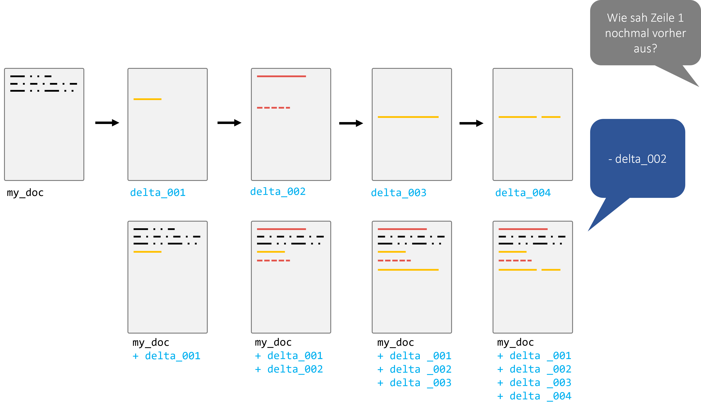

# Versionskontrolle mit Git

## Motivation

Sicherlich erinnert sich jeder an Zeiten, in denen man an einem größeren Dokument oder Programmcode arbeitete und unterschiedliche Versionen unter diversen Namen speicherte: "Projekt_Final", "Projekt_Final_v2", "Projekt_EchtJetztFinal". Das mag auf den ersten Blick praktikabel erscheinen, insbesondere wenn man allein an einem Projekt arbeitet. 
(Und, keine Sorge, das hat jede/r von uns schon so gemacht!)

Doch die Realität zeigt, dass diese Methode zahlreiche Fallstricke birgt:

1. **Unübersichtlichkeit**: Schnell sammeln sich viele Dateiversionen an, und es wird zunehmend schwerer, den Überblick zu behalten.
2. **Verwirrung**: Es ist unklar, welche Änderungen in welcher Dateiversion vorgenommen wurden, vor allem wenn klare Benennungskonventionen fehlen.
3. **Teamarbeit**: In Projekten, in denen mehrere Personen beteiligt sind, wird dieser Ansatz rasch unpraktikabel. Wie stellt man sicher, dass jeder Zugriff auf die neueste Version hat? Wie kombiniert man die Änderungen mehrerer Personen?

Der letzte Punkt ist besonders problematisch, wenn Teammitglieder asynchron arbeiten, d.h., nicht gleichzeitig oder an verschiedenen Orten. Das manuelle Zusammenführen (oder "Mergen") von Dateien kann zu Fehlern führen, Überschneidungen verursachen und ist sehr zeitaufwändig. Einige Änderungen könnten sogar verloren gehen oder überschrieben werden.


Hier kommt die Versionskontrolle ins Spiel! Sie stellt eine elegante Lösung für diese Herausforderungen dar und ermöglicht es Einzelpersonen und Teams, effizienter und fehlerfreier zu arbeiten.


## Warum Versionskontrolle (version control)?

Die Versionskontrolle ermöglicht es uns, den Verlauf und die Entwicklung eines Projekts zu verfolgen und zu steuern. Zu den Hauptvorteilen gehören:

- **Aufzeichnen von Änderungen**: Sie können genau sehen, welche Änderungen wann und von wem vorgenommen wurden.
- **Vergleich von Versionen**: Wenn Sie wissen wollen, was zwischen zwei Versionen geändert wurde, können Sie das einfach herausfinden.
- **Einfaches Teilen**: Sie können Ihre Arbeit mit anderen teilen, und diese können ihre Änderungen mit Ihnen teilen.
- **Mergen von Änderungen**: Kombinieren Sie die Arbeit von mehreren Personen in einem zentralen Projekt.
- **Tags für Releases**: Markieren Sie bestimmte Punkte in der Geschichte Ihres Projekts als offizielle Releases oder Versionen.
- **Experimentieren ohne Risiko**: Mit Branches können Sie neue Ideen ausprobieren, ohne die Hauptversion Ihres Projekts zu beeinflussen.
- **Industriestandard**: Fast alle professionellen Software- und Datenprojekte verwenden eine Art von Versionskontrolle.

**Achtung:** Es ist wichtig zu betonen, dass Versionskontrolle **nicht dasselbe ist wie ein Backup**. Obwohl Sie zu früheren Versionen zurückkehren können, ersetzt dies nicht die Notwendigkeit von Backups für Datenverlustszenarien.


## Einführung in Git

Git wurde 2005 von Linus Torvalds initiiert, ursprünglich als Werkzeug zur Versionskontrolle für die Entwicklung des Linux-Kernels. Es hat sich jedoch schnell zu einem der am weitesten verbreiteten Versionskontrollsysteme weltweit entwickelt und ist heute der Standard im Software- und IT-Bereich.

### Ziele von Git

Git wurde mit einigen zentralen Zielen im Hinterkopf entwickelt, darunter:

- **Sicherheit**: Jede Änderung wird sicher und nachvollziehbar gespeichert, sodass der gesamte Verlauf der Änderungen lückenlos dokumentiert ist.
- **Effizienz**: Git ist darauf optimiert, effizient auch mit großen Projekten und vielen Änderungen zu arbeiten.

### Komplex, aber nur das Nötigste

Obwohl Git sehr mächtig und komplex ist, benötigen die meisten Benutzer*innen nur eine Handvoll grundlegender Funktionen. Diese Kernfunktionen ermöglichen es, Git produktiv zu nutzen, ohne sich mit den tieferen technischen Details auseinandersetzen zu müssen.

### Der Standard in der Softwareentwicklung

In der heutigen Softwareentwicklung ist Git das zentrale Werkzeug für Versionskontrolle. Andere Systeme spielen in der Praxis kaum noch eine Rolle und werden in professionellen Umgebungen selten verwendet. Das bedeutet, dass Git-Kenntnisse in den meisten IT-Berufen und Softwareprojekten unerlässlich sind.

## Wie funktioniert Git?

Git speichert nicht einfach vollständige Kopien von Dateien. Stattdessen konzentriert es sich auf die Unterschiede, die sogenannten "Deltas", zwischen verschiedenen Versionen von Dateien. Dies macht Git besonders effizient, da nur die Änderungen gespeichert werden und nicht jede Datei komplett neu.




## Grundlegender Prozess

Der grundlegende Git-Workflow basiert auf einem einfachen Zyklus von Änderungen, der sich in drei Phasen unterteilt:

- **Staging**: Hier werden die Änderungen ausgewählt, die im nächsten Commit gesichert werden sollen.
- **Commit**: Die ausgewählten Änderungen werden mit einer Commit-Nachricht festgehalten, die beschreibt, was geändert wurde.
- **Push/Pull**: Änderungen werden in ein entferntes Repository hochgeladen (push), oder aktuelle Änderungen von dort heruntergeladen (pull).


### Branches

Branches sind parallele Versionen eines Projekts. Sie ermöglichen es, an neuen Features oder Ideen zu arbeiten, ohne die  Haupt-"Produktions"-Version des Codes zu beeinflussen. Sobald ein Feature fertig ist, wird es in den Hauptzweig – oft "main" genannt – eingefügt (gemerged).


## Es geht nicht nur um eine Datei!

In den Anfangsphasen kann es sein, dass Projekte nur aus einer einzigen Datei bestehen. Aber größere Projekte, insbesondere im Bereich Softwareentwicklung und Datenwissenschaft, bestehen oft aus vielen Dateien und Ordnern. Ein solches Set von Dateien und Ordnern, das unter Versionskontrolle steht, wird als **Repository** bezeichnet.

**Hinweis**: Während Git hervorragend für Quellcode ist, ist es nicht immer ideal für große Datenmengen. Es ist wichtig, die richtigen Werkzeuge für den jeweiligen Job zu verwenden.


**Wichtig:** Versionskontrolle ist kein allgemeines Backup-Tool und sollte nicht ohne besonderen Grund auf (größere) Daten angewendet werden!


## Warum immer Shell/Bash/Terminal?

In vielen Anleitungen und Tutorials zum Thema Git wird oft der Umgang mit Git über die Kommandozeile, auch Shell, Bash oder Terminal genannt, gezeigt. Aber warum eigentlich? Gibt es keine alternativen Wege, Git zu nutzen?

### GUIs und IDEs

Tatsächlich gibt es diverse grafische Benutzeroberflächen (GUIs) für Git. Diese bieten oft eine intuitivere und visuell ansprechendere Erfahrung im Vergleich zur schlichten Kommandozeile:

- **Allgemeine GUIs**: Websites wie [git-scm](https://git-scm.com/downloads/guis) bieten eine Übersicht über verschiedene GUIs, die für Git verfügbar sind.
- **GitHub Desktop**: Ein spezielles Tool von GitHub, das sich besonders für Anfänger eignet, da es die wichtigsten Funktionen von Git in einer einfach zu verstehenden Oberfläche bereitstellt. Mehr dazu auf [desktop.github.com](https://desktop.github.com/).
- **Integrierte Entwicklungsumgebungen (IDEs)**: Viele moderne IDEs, wie z.B. Visual Studio Code, haben eingebaute Git-Funktionalitäten. Das ermöglicht es Entwicklern, Änderungen zu verfolgen, Commits zu machen und sogar zu pushen, ohne die IDE verlassen zu müssen.
- **Diff-Tools**: Zum Anzeigen und Mergen von Änderungen zwischen Dateien oder Branches gibt es spezialisierte Tools wie [DiffMerge](https://sourcegear.com/diffmerge/downloads.html). Solche Werkzeuge bieten oft eine visuell klarere Darstellung von Unterschieden als reine textbasierte Werkzeuge.

### Die Vorteile der Kommandozeile

Obwohl all diese Tools existieren, bevorzugen viele Entwickler immer noch die Kommandozeile. Warum?

1. **Flexibilität**: Mit der Kommandozeile haben Sie vollen Zugriff auf alle Git-Funktionen. Manche speziellen Befehle sind in GUIs nicht verfügbar oder schwer zu finden.
2. **Universalität**: Unabhängig von Ihrem Betriebssystem oder Ihrer bevorzugten Entwicklungsumgebung funktioniert die Kommandozeile immer gleich. Dies erleichtert die Zusammenarbeit in gemischten Teams und das Befolgen von Anleitungen aus dem Internet.
3. **Automatisierung**: Durch die Verwendung von Shell-Skripten können wiederkehrende Aufgaben leicht automatisiert werden.

### Fazit

Zusätzlich zu all diesen Tools und Methoden kann auch vieles direkt im Webbrowser durchgeführt werden, wenn man z.B. GitHub verwendet. Von einfachem Browsing über das Erstellen von Pull Requests bis hin zur Code-Review – vieles ist direkt im Browser möglich.

Letztlich geht es darum, das richtige Werkzeug für den jeweiligen Job und den eigenen Komfort zu finden. Es gibt kein "richtig" oder "falsch", sondern nur unterschiedliche Werkzeuge und Ansätze, die je nach Situation und Vorliebe variieren können.

## Rad nicht neu erfinden

Da Git in der Softwarebranche weit verbreitet ist, gibt es zahlreiche Ressourcen, um es zu lernen und zu verstehen. Darum wird dies hier im Skript auch nicht ausführlich alles wiederholt. Hier also ein paar Vorschläge mit denen sich das Thema gut erschließen lässt:

- [W3Schools Git Tutorial](https://www.w3schools.com/git/)
- [Atlassian's Git Guide](https://www.atlassian.com/git)

**Empfehlung:** Es kann auch hilfreich sein, interaktive Tutorials oder Kurse zu belegen, um die praktische Anwendung von Git zu üben.

```{info}
Allgemein gilt beim Thema Git und GitHub was auch beim Programmieren gilt: Es kann nicht rein theoretisch über Videos, Vorlesungen, Bücher erlernt werden, sondern eigentlich nur über das Umsetzen in der Praxis. Das heißt, es macht durchaus Sinn sich etwas zu zwingen in den kommenden Projekten bewusst auf den Einsatz von Git zu setzen um Erfahrung damit zu sammeln.
```


### Weitere Quellen:

Für die Live Coding Sessions wird Material vom [Data Carpentry Git Course](https://swcarpentry.github.io/git-novice/) verwendet. Anders als die Links weiter oben ist das Material aber nicht primär zum Selbststudium gedacht.