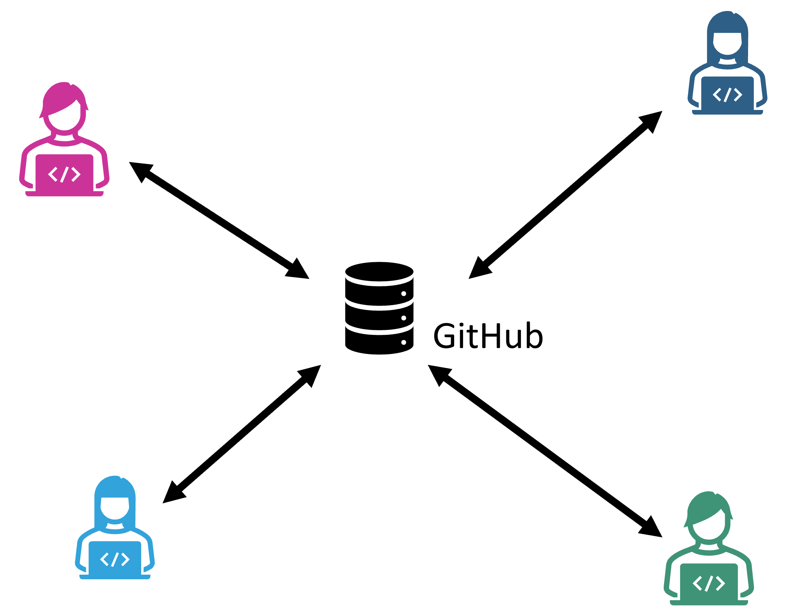
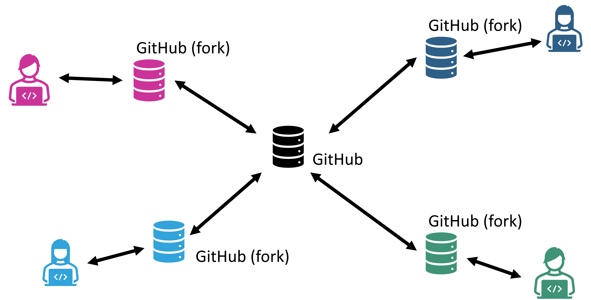
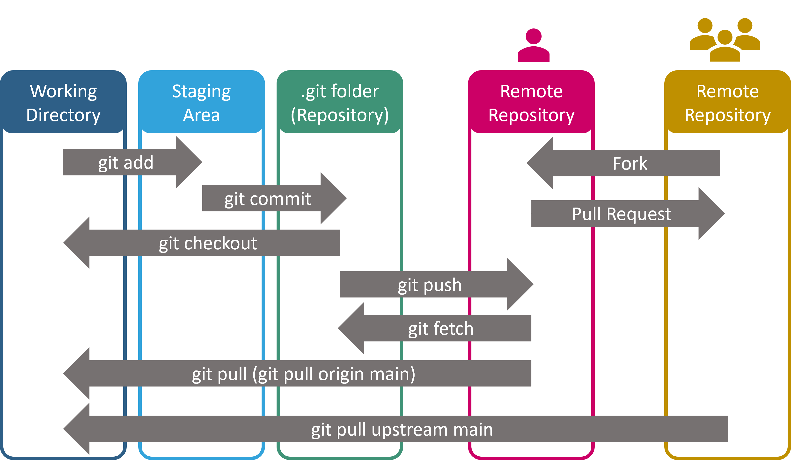

# Zusammenarbeit mit GitHub

Git funktioniert lokal. GitHub ergänzt ein **Remote Repository** und Werkzeuge für Zusammenarbeit: Issues, Pull Requests, Reviews, Actions und Projektboards. In diesem Kapitel geht es vor allem um den kollaborativen Workflow; Testing, Ruff und CI werden in den folgenden Kapiteln systematisch aufgebaut.

## Lokal und Remote

Repository klonen:

```bash
git clone https://github.com/<organisation>/<repository>.git
cd <repository>
```

Remotes anzeigen:

```bash
git remote -v
```

Typischer Name des primären Remotes:

```text
origin
```

Änderungen hochladen:

```bash
git push
```

Änderungen holen und integrieren:

```bash
git pull
```

Für Einsteiger:innen ist wichtig: Vor `pull` immer `git status` prüfen und eigene Arbeit sinnvoll committen oder anderweitig sichern.

## Der Kursworkflow

Für Teamprojekte verwenden wir standardmäßig:

```text
Issue
  ↓
Branch
  ↓
kleine Commits
  ↓
Pull Request
  ↓
CI
  ↓
Code Review
  ↓
Änderungen / Diskussion
  ↓
Merge nach main
```

`main` soll einen möglichst stabilen Projektstand repräsentieren.

## Issues: eine gute Aufgabe beschreiben

Schlecht:

```text
Implement AI
```

Besser:

```markdown
## Goal
Add a random-move strategy for the game.

## Acceptance criteria
- only legal moves are returned
- full boards are handled explicitly
- behavior is covered by automated tests
- existing game loop does not need special cases for this strategy
```

Ein Issue ist nicht nur Verwaltung. Es zwingt das Team, **vor dem Coden zu klären, wann die Aufgabe fertig ist**.

## Branch pro Aufgabe

```bash
git switch -c issue-17-random-strategy
```

Branch-Namen müssen nicht perfekt sein. Sie sollten aber den Zusammenhang zur Aufgabe sichtbar machen.

## Push und Pull Request

```bash
git push -u origin issue-17-random-strategy
```

Danach auf GitHub einen Pull Request eröffnen.

Eine gute PR-Beschreibung beantwortet:

- Was ändert dieser PR?
- Welches Issue gehört dazu?
- Wie wurde getestet?
- Gibt es offene Entscheidungen oder Risiken?
- Wurde Performance beeinflusst?

## Code Review

Reviewer prüfen nicht nur Stil. Vieles davon werden wir später mit Ruff automatisieren; im Review sind deshalb vor allem Verhalten, Verständlichkeit, Tests und Design wichtig.

Wichtiger sind Fragen wie:

- Erfüllt der Code die Akzeptanzkriterien?
- Verstehe ich die Änderung?
- Sind Tests aussagekräftig?
- Gibt es Randfälle?
- Wurde unnötige Komplexität hinzugefügt?
- Sind neue Abhängigkeiten notwendig?
- Passt die Änderung zur Architektur?

Konstruktive Reviews beziehen sich auf Code und Anforderungen, nicht auf die Person.

Beispiel:

```text
Could we add a test for a full board here? At the moment this branch seems to assume that at least one legal move exists.
```

## CI ist Teil des Reviews

Ein grüner Workflow zeigt, dass automatisierte Checks bestanden wurden. Das ist notwendig, aber nicht hinreichend.

```text
CI says: "the automated checks passed"
Reviewer says: "this change is understandable and appropriate"
```

## Shared Repository vs. Fork

### Shared/central Repository

Alle Teammitglieder haben Schreibrechte und arbeiten über Branches + PRs. Für feste Vierer-Teams ist das meist der einfachste Kursworkflow.



### Fork Workflow

Jede Person arbeitet in einer eigenen Kopie und schlägt Änderungen an einem `upstream`-Repository vor. Das ist typisch für Open-Source-Projekte oder wenn Contributor keine direkten Schreibrechte haben.

Dann gibt es oft:

```text
origin    → eigener Fork
upstream  → zentrales Projekt
```

Für den Einstieg sollte man nicht beide Modelle gleichzeitig vermischen.





## Merge-Konflikte in GitHub-Projekten vermeiden

Konflikte werden weniger wahrscheinlich, wenn:

- Issues klein sind,
- Branches nicht wochenlang offen bleiben,
- regelmäßig synchronisiert wird,
- Teams nicht gleichzeitig dieselben großen Dateien umbauen.

Konflikte lassen sich nie vollständig vermeiden. Sie sind ein normaler Teil kollaborativer Entwicklung.

## GitHub Projects / Kanban

Ein leichtgewichtiges Board reicht:

```text
Backlog → In Arbeit → Review → Erledigt
```

Wichtiger als viele Spalten ist:

- klare Issues,
- sichtbare Verantwortlichkeit,
- begrenzte parallele Arbeit,
- regelmäßige Aktualisierung.

## Schutz für `main`

Je nach Repository-Rechten können GitHub Rulesets/Branch-Schutzregeln festlegen:

- Pull Request erforderlich,
- erfolgreiche CI-Checks erforderlich,
- Review erforderlich,
- Force Push verhindern.

Damit wird der gewünschte Workflow technisch unterstützt.

## Secrets

Nie committen:

```text
API keys
access tokens
passwords
private credentials
```

Auch ein späteres Löschen aus der aktuellen Datei entfernt ein Secret nicht automatisch aus der Git-Historie.

## Coding Agents und GitHub

Ein Coding Agent sollte eine **begrenzte, überprüfbare Aufgabe** bekommen. Ein gutes Issue mit Akzeptanzkriterien ist deshalb gleichzeitig eine gute Grundlage für menschliche und agentische Arbeit.

Nach einer Agent-Änderung:

1. PR-Diff lesen.
2. Tests nachvollziehen.
3. Neue Dependencies prüfen.
4. CI ausführen.
5. Änderungen verlangen, wenn etwas unklar ist.
6. Nur mergen, wenn ein Mensch die Verantwortung übernimmt.

## Definition of Done für Kurs-Issues

Eine Aufgabe ist typischerweise erst erledigt, wenn:

- Akzeptanzkriterien erfüllt sind,
- Tests vorhanden und grün sind,
- Ruff/Format-Checks grün sind,
- PR reviewed wurde,
- notwendige Dokumentation angepasst wurde,
- und der Code in `main` gemerged ist.
