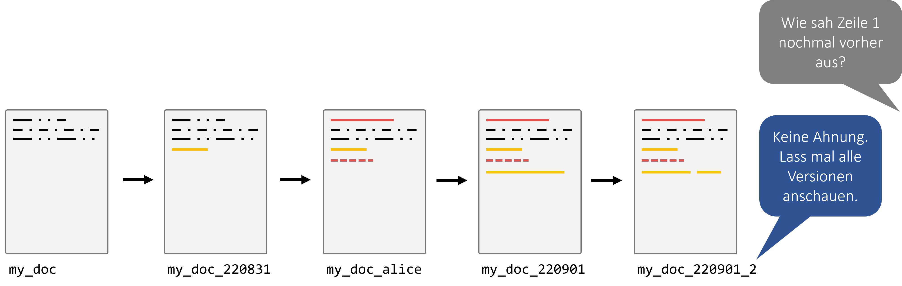
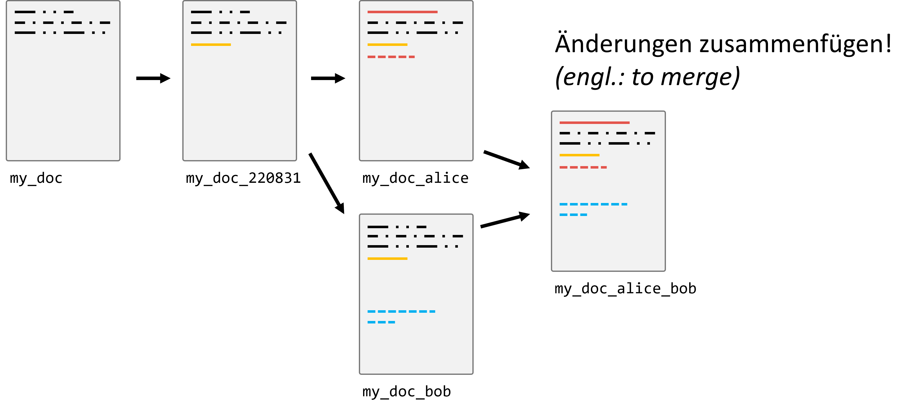
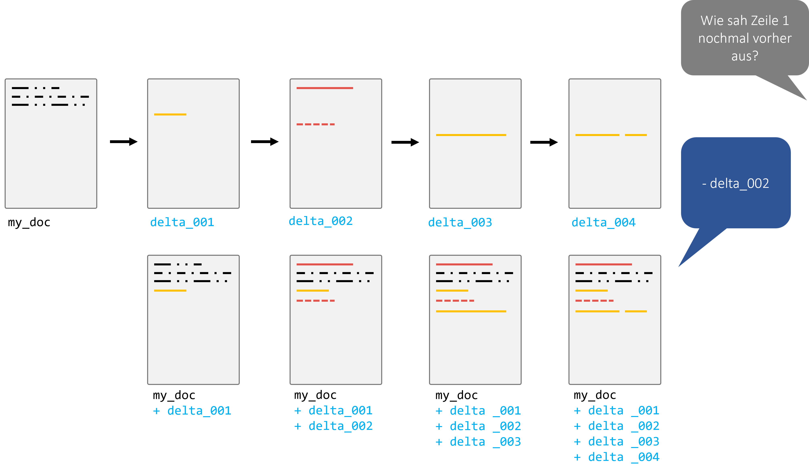
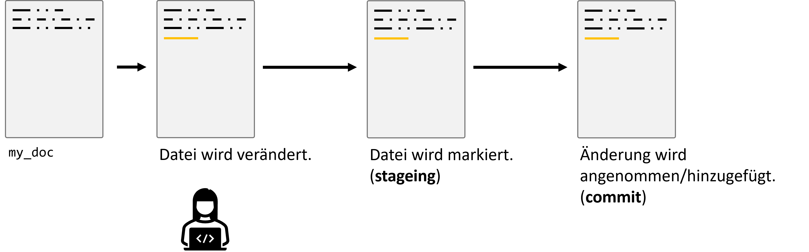
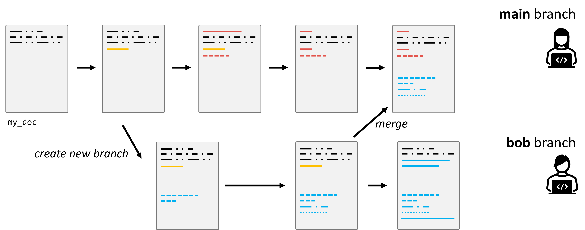

# Git & GitHub

## Motivation

Sicherlich erinnert sich jeder an Zeiten, in denen man an einem größeren Dokument oder Programmcode arbeitete und unterschiedliche Versionen unter diversen Namen speicherte: "Projekt_Final", "Projekt_Final_v2", "Projekt_EchtJetztFinal". Das mag auf den ersten Blick praktikabel erscheinen, insbesondere wenn man allein an einem Projekt arbeitet. 
(und... keine Sorge... das hat jede/r von uns schon so gemacht!)

Doch die Realität zeigt, dass diese Methode zahlreiche Fallstricke birgt:

1. **Unübersichtlichkeit**: Schnell sammeln sich viele Dateiversionen an, und es wird zunehmend schwerer, den Überblick zu behalten.
2. **Verwirrung**: Es ist unklar, welche Änderungen in welcher Dateiversion vorgenommen wurden, vor allem wenn klare Benennungskonventionen fehlen.
3. **Teamarbeit**: In Projekten, in denen mehrere Personen beteiligt sind, wird dieser Ansatz rasch unpraktikabel. Wie stellt man sicher, dass jeder Zugriff auf die neueste Version hat? Wie kombiniert man die Änderungen mehrerer Personen?

Der letzte Punkt ist besonders problematisch, wenn Teammitglieder asynchron arbeiten, d.h., nicht gleichzeitig oder an verschiedenen Orten. Das manuelle Zusammenführen (oder "Mergen") von Dateien kann zu Fehlern führen, Überschneidungen verursachen und ist sehr zeitaufwändig. Einige Änderungen könnten sogar verloren gehen oder überschrieben werden.

Hier kommt die Versionskontrolle ins Spiel! Sie stellt eine elegante Lösung für diese Herausforderungen dar und ermöglicht es Einzelpersonen und Teams, effizienter und fehlerfreier zu arbeiten.

## Warum Versionskontrolle (version control)?

Die Versionskontrolle ermöglicht es uns, den Verlauf und die Entwicklung eines Projekts zu verfolgen und zu steuern. Zu den Hauptvorteilen gehören:

- **Aufzeichnen von Änderungen**: Sie können genau sehen, welche Änderungen wann und von wem vorgenommen wurden.
- **Vergleich von Versionen**: Wenn Sie wissen wollen, was zwischen zwei Versionen geändert wurde, können Sie das einfach herausfinden.
- **Einfaches Teilen**: Sie können Ihre Arbeit mit anderen teilen, und diese können ihre Änderungen mit Ihnen teilen.
- **Mergen von Änderungen**: Kombinieren Sie die Arbeit von mehreren Personen in einem zentralen Projekt.
- **Tags für Releases**: Markieren Sie bestimmte Punkte in der Geschichte Ihres Projekts als offizielle Releases oder Versionen.
- **Experimentieren ohne Risiko**: Mit Branches können Sie neue Ideen ausprobieren, ohne die Hauptversion Ihres Projekts zu beeinflussen.
- **Industriestandard**: Fast alle professionellen Software- und Datenprojekte verwenden eine Art von Versionskontrolle.

**Achtung:** Es ist wichtig zu betonen, dass Versionskontrolle **nicht dasselbe ist wie ein Backup**. Obwohl Sie zu früheren Versionen zurückkehren können, ersetzt dies nicht die Notwendigkeit von Backups für Datenverlustszenarien.

## Wie funktioniert Git (ungefähr)

Git speichert nicht komplette Dateikopien, sondern konzentriert sich auf die Unterschiede zwischen den Versionen. Bei jeder Änderung speichert Git diese als Deltas, also Unterschiede zur vorherigen Version.

## Grundlegender Prozess

Bei Git geht es um den Zyklus von Änderungen, die in drei Phasen auftreten:

- **Staging**: Auswahl der Änderungen, die Sie im nächsten Schritt speichern möchten.
- **Commit**: Die ausgewählten Änderungen festhalten und eine Nachricht hinzufügen, die beschreibt, was gemacht wurde.
- **Push/Pull**: Teilen Sie Ihre Änderungen mit einem entfernten Repository oder holen Sie sich die neuesten Änderungen von dort.

### Branches

Branches sind parallele Versionen eines Projekts. Sie ermöglichen es, an neuen Features oder Ideen zu arbeiten, ohne die  Haupt-"Produktions"-Version des Codes zu beeinflussen. Wenn ein Feature  fertig ist, kann es in den Hauptzweig (meistens "master" oder "main"  genannt) eingefügt (gemerged) werden.

## Es geht nicht nur um eine Datei!

In den Anfangsphasen kann es sein, dass Projekte nur aus einer einzigen Datei bestehen. Aber größere Projekte, insbesondere im Bereich Softwareentwicklung und Datenwissenschaft, bestehen oft aus vielen Dateien und Ordnern. Ein solches Set von Dateien und Ordnern, das unter Versionskontrolle steht, wird als **Repository** bezeichnet.

**Hinweis**: Während Git hervorragend für Quellcode ist, ist es nicht immer ideal für große Datenmengen. Es ist wichtig, die richtigen Werkzeuge für den jeweiligen Job zu verwenden.

**Wichtig:** 

Versionskontrolle ist kein allgemeines Backup-Tool und sollte nicht ohne besonderen Grund auf (größere) Daten angewendet werden!

## Rad nicht neu erfinden

Da Git in der Softwarebranche weit verbreitet ist, gibt es zahlreiche Ressourcen, um es zu lernen und zu verstehen. Nutzen Sie diese Ressourcen, um Ihr Wissen zu vertiefen und bestmögliche Praktiken zu erlernen. Hier sind ein paar Vorschläge:

- [W3Schools Git Tutorial](https://www.w3schools.com/git/)
- [Atlassian's Git Guide](https://www.atlassian.com/git)

**Empfehlung:** Es kann auch hilfreich sein, interaktive Tutorials oder Kurse zu belegen, um die praktische Anwendung von Git zu üben.

### Weitere Quellen:

Für die Live Coding Sessions wird Material vom [Data Carpentry Git Course](https://swcarpentry.github.io/git-novice/) verwendet. Anders als die Links weiter oben ist das Material aber nicht primär zum Selbststudium gedacht.