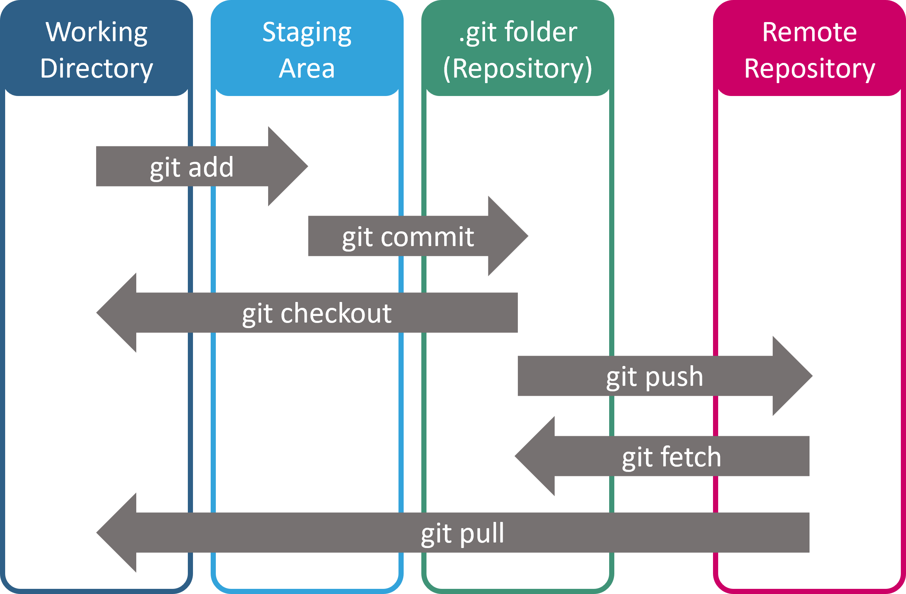
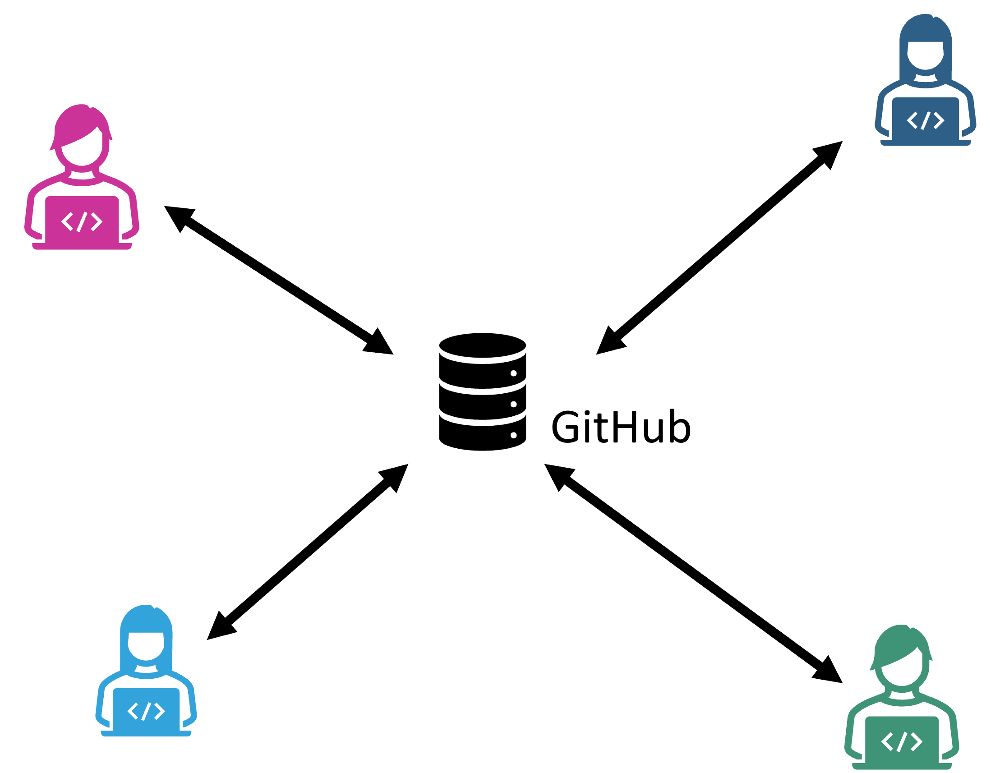
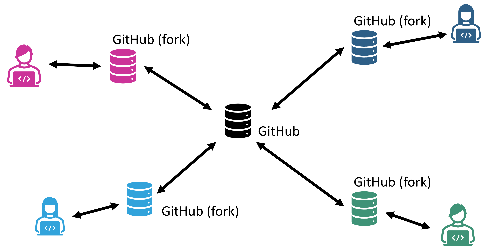
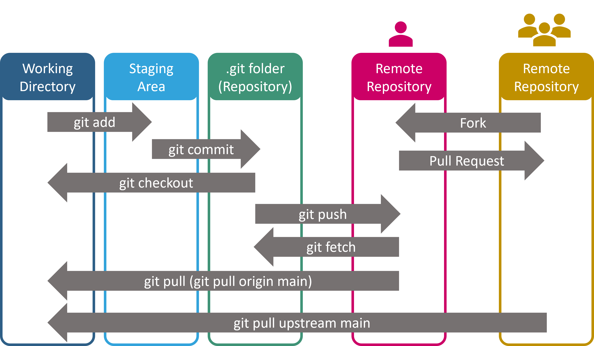

# GitHub

Während **Git** als dezentrales Versionskontrollsystem dient, das in erster Linie lokal auf dem Computer eines Entwicklers betrieben wird, kommt der wahre Mehrwert von Git häufig erst dann zur Geltung, wenn es in Verbindung mit einem zentralen Repository-Hosting-Service verwendet wird. Hier treten Plattformen wie **GitHub**, **GitLab** und **Bitbucket** in Erscheinung.

## Kurzer Vergleich

- **GitHub**: Eine der populärsten Plattformen für das Hosting von Git-Repositories. Sie bietet eine benutzerfreundliche Oberfläche, integrierte Issue-Tracking-Tools und einen lebhaften Marktplatz für Erweiterungen. Mit der jüngsten Übernahme durch Microsoft hat GitHub auch eine enge Integration in viele Microsoft-Produkte, insbesondere Visual Studio, erhalten.
- **GitLab**: Ein Open-Source-Git-Repository-Manager, der sowohl als selbst gehostete Lösung als auch in einer Cloud-basierten Version verfügbar ist. GitLab bietet viele fortschrittliche Features, insbesondere im Bereich der CI/CD-Integration. Durch die Möglichkeit des eigenen Hostings wird es oft innerhalb von Firmen verwendet.
- **Bitbucket**: Ursprünglich von Atlassian entwickelt und bietet eine tiefe Integration mit anderen Atlassian-Produkten wie JIRA und Confluence. Es unterstützt sowohl Git als auch Mercurial und wird in vielen Unternehmen eingesetzt.

Für den Zweck dieser Veranstaltung werden wir uns auf **GitHub** konzentrieren.

## Achtung: GitHub ist eine für alle einsehbare Visitenkarte!

Ein öffentliches GitHub-Repository kann viel über einen Entwickler aussagen. Es dient oft als Portfolio für zukünftige Arbeitgeber oder für die Gemeinschaft.

- Mit einem aktiven GitHub-Account könnt ihr demonstrieren, dass ihr engagierte und ernstzunehmende Programmierer*innen seid – oder eben auch das Gegenteil, wenn das Repository vernachlässigt wird.
- Bei Vorstellungsgesprächen kann euer GitHub-Profil als Beweis für eure Fähigkeiten und Erfahrungen im Umgang mit Softwareentwicklung dienen.

## Grundlegender Prozess

### Lokal vs. Remote

Mit Git arbeitet man zunächst lokal auf dem eigenen Computer (lokales Repository). Wenn man dann Änderungen mit anderen teilen möchte oder eine sichere Kopie seiner Arbeit in der Cloud haben möchte, "pusht" man die Änderungen zu einem Remote-Repository, z.B. auf GitHub.

Um das lokale Repository mit der online Repository abzugleichen werden wir v.a. die folgenden Befehle nutzen

- `git push` - damit werden die neuen Commits ins online Repository verschoben
- `git pull` - damit werden neue Commits aus dem online ins lokale Working Directory verschoben. 
  (Achtung, d.h. es werden eventuell gerade erst bearbeitete Änderungen von uns überschrieben, daher vor git pull darauf achten, dass alle Änderungen bereits zu Git hinzugefügt wurden --> `git status`)

### Working in Teams: Centralized Workflow

- Bei diesem Ansatz haben alle Teammitglieder Schreibzugriff auf das zentrale Repository.
- Die Entwicklung erfolgt hauptsächlich über verschiedene Branches, wobei jeder Branch eine bestimmte Aufgabe oder ein Feature repräsentiert.
- Nachdem die Arbeit in einem Branch abgeschlossen ist, wird er in den Hauptbranch (oft "master" oder "main" genannt) gemerged. 
  In der Regel geschieht dies über einen Pull Request um sowohl die Dokumentation als auch die Qualität des Projektes zu verbessern.

### Working in Teams: Fork-based Workflow

Dieser Workflow wird vor allem in großen Projekten verwendet, insbesondere bei Community- oder Open-Source-Projekten.

- Jeder Entwickler erstellt einen "Fork" des Hauptrepositories, was im Wesentlichen eine Kopie des Repositories ist, aber unabhängig von dem Original.
- Entwickler führen Änderungen in ihrem eigenen Fork durch und wenn sie bereit sind, ihre Änderungen mit dem Hauptrepository zu teilen, erstellen sie einen "Pull Request".
- Ein "Pull Request" ist eine Anfrage, Änderungen aus dem Fork in das Hauptrepository zu übernehmen. Es bietet auch eine Plattform für Code-Reviews und Diskussionen, bevor die Änderungen übernommen werden.

In diesem Fall ist die Struktur der Abläufe in Git noch einen Schritt komplexer. Es gibt nun nicht mehr nur unsere lokale Kopie sowie `origin` (Remote Repository im eigenen GitHub Account, oder Remote Repository mit umfangreichen Schreibrechten), sondern auch noch `upstream` als weiteres Remote Repository. Letzteres ist in der Regel das "Hauptrepository", also nach außen der zentrale Anlaufpunkt. In vielen Fällen haben Nutzer\*innen auch gar keine direkten Schreibrechte für dieses Repository, z.B. bei großen Community-Projekten. Der hier beschriebene Workflow wird aber auch genutzt um einem beliebigen auf GitHub stehenden Repository eigene Änderungen vorschlagen zu können (wenn dies die jeweiligen Rechteinhaber\*innen wünschen).

## Getting started

Wie auch zu Git, findet ihr im Netz viele Tutorials und Informationen zum Arbeiten mit GitHub.
Zum Beispiel die [Einführungsseiten GitHub](https://docs.github.com/en/get-started).

