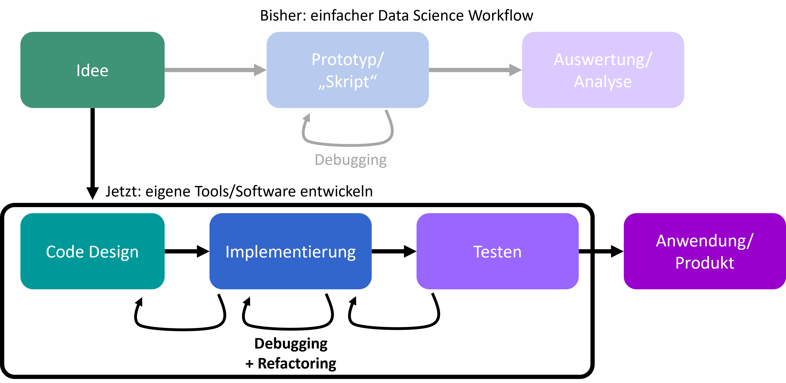

# Clean Code

**Eingangsfrage 1:**
*Was bedeutet „besser“?*

**Antworten:**

- „Besser“ definiert eine Richtung, aber keinen festen Endpunkt.
- Perfektion ist nicht das Endziel, da es im wirklichen Leben selten erreichbar ist.
- Ziel ist, einen Code zu schreiben, der beständig, wiederholbar und zuverlässig arbeitet.
- Die kommenden Wochen werden tiefer in diese Prinzipien eintauchen.

------

**Eingangsfrage 2:**
*Und: brauch ich das?*

**Antworten:**

1. Ja! Schon aus pragmatischen Gründen:

- Ohne solide (Python-)Programmierkenntnisse ist ein Abschluss in DAISY kaum machbar.
- Firmen haben Erwartungen, wenn "Data Science / KI" im Lebenslauf steht. Und sie prüfen diese!

1. Solide Programmierfähigkeiten öffnen in der Data Science / KI Welt viele Türen. Es geht nicht nur ums Programmieren, sondern auch um das Verstehen und Leiten von Projekten.

------

In der Welt der Programmierung geht es nicht nur darum, dass der Code funktioniert. Die Art und Weise, wie der Code geschrieben, organisiert und präsentiert wird, kann einen großen Unterschied in der Produktivität, Zusammenarbeit und Wartungsfähigkeit machen. In diesem Teil werden wir uns mit den Prinzipien des "Clean Code" und den Best Practices für besseres Programmieren in Data Science und KI vertiefend beschäftigen.

## **1. Die Bedeutung von „besserem“ Code**

**1.1. Was ist „besser“?**
„Besser“ ist ein relatives Konzept. In der Programmierung bezieht es sich oft darauf, wie effizient, lesbar und wartbar ein Code ist. Es ist wichtig zu betonen, dass "besser" nicht immer "perfekt" bedeutet. In der echten Welt ist es oft nicht möglich oder sogar notwendig, einen perfekten Code zu schreiben. Stattdessen sollte das Ziel sein, ständig zu verbessern und einen Code zu erstellen, der wiederholbar und zuverlässig funktioniert.

**1.2. Warum besserer Code wichtig ist**
Besserer Code ist aus mehreren Gründen wichtig:

- **Zuverlässigkeit:** Code, der den Best Practices folgt, hat tendenziell weniger Fehler und ist vorhersehbarer.
- **Wartbarkeit:** Es ist einfacher, Code zu aktualisieren und zu verbessern, wenn er gut organisiert und dokumentiert ist.
- **Zusammenarbeit:** In Teams ist es wesentlich einfacher, mit Code zu arbeiten, der den gemeinsamen Standards folgt.

## **2. Der erweiterte Entwicklungsprozess**

Bisher (z.B. bei einfacheren Data Science Workflows) konnten wir oft mit recht reduzierten Code-Entwicklungsabläufen arbeiten. Im Prinzip haben wir dabei oft nur iterativ ein Skript (oder Jupyter Notebook) erstellt und solange verändert/verbessert bis es die gewünschten Ergebnisse liefert.

Für umfangreichere Projekte, oder aber auch die Entwicklung eigener Tools oder Software, reicht das in der Regel aber nicht mehr aus!



**2.1. Idee**
Jeder Entwicklungsprozess beginnt mit einer Idee oder einem Problem. Es ist wichtig, diese Idee klar zu definieren und zu verstehen, welche Herausforderungen sie mit sich bringt.

**+ Recherche**
Bevor man mit der Programmierung beginnt, sollte man sich einen Überblick über bestehende Lösungen, Datenquellen und Tools verschaffen.

**+ Prototyping**
Hier wird eine erste, oft rudimentäre Lösung entwickelt, um die Machbarkeit zu testen.

**2.2. Code Design**
Ein oft übersehener Schritt, aber entscheidend für den Erfolg des Projekts. Hier wird der Code geplant, Strukturen werden erstellt und mögliche Herausforderungen antizipiert.

**2.3. Implementierung**
Der eigentliche Programmierprozess. Hier wird der zuvor geplante Code umgesetzt.

**2.4. Testen**
Nach der Implementierung muss der Code gründlich getestet werden. Dies stellt sicher, dass er wie erwartet funktioniert und frei von Fehlern ist.

**2.5. Auswertung und Analyse**
Nach dem Testen wird der Code analysiert. Funktioniert alles wie erwartet? Gibt es noch Optimierungsmöglichkeiten?

**2.6. Anwendung und Produktion**
Sobald der Code vollständig getestet und analysiert wurde, kann er in die Produktion übernommen werden.

Das ist keinesfalls ein zwingender Entwicklungsablauf, sondern soll nur eine erste Idee vermitteln, dass der Prozess insgesamt deutlich komplexer ist als ein Jupyter Notebook "zusammenzubasteln".

## **3. Clean Code - Grundlagen**

#### Was ist Clean Code?
Clean Code ist ein Code, der leicht zu lesen, zu verstehen und zu warten ist. Es geht nicht nur darum, wie der Code aussieht, sondern auch darum, wie er strukturiert ist.

#### Weshalb Clean Code?

- **Lesbarkeit:** Ein sauberer Code ist einfacher zu lesen und zu verstehen.
- **Wartbarkeit:** Ein sauberer Code ist einfacher zu warten und zu erweitern.
- **Produktivität:** Mit sauberem Code können Entwickler schneller und effizienter arbeiten.

**Eingangsbeispiele und ihre Bedeutung**
Zur Verdeutlichung der Prinzipien von Clean Code werden im Laufe des Kapitels verschiedene Codebeispiele analysiert und diskutiert.

```python
animals = ['dog', 'cat', 'elephant']
# vs
animals= [    'dog',   'cat',"elephant"   ]
```

**Fragen zum Nachdenken:**

- Wer legt fest, wie Code aussehen sollte?
- Warum nicht individuell entscheiden?

**Antworten:**

- Für den Python-Interpreter ist der Stil nebensächlich, aber Menschen lesen den Code!
- Ziel 1: Der Stil soll die Lesbarkeit unterstützen.
- Ziel 2: Code sollte global verständlich sein, nicht nur für den Autor.

### **Style Guides und ihre Bedeutung**

Style Guides sind Sammlungen von Konventionen und Best Practices für eine bestimmte Programmiersprache oder ein bestimmtes Framework. Sie definieren einen Standard, wie Code geschrieben und formatiert werden sollte, um Konsistenz, Lesbarkeit und Wartbarkeit zu gewährleisten.

In der Welt von Python ist PEP 8 der bekannteste und am weitesten verbreitete Style Guide, und viele der Konzepte und Prinzipien, die er enthält, sind nicht nur für Python, sondern auch für andere Sprachen relevant.

#### PEP 8 - Der Python Style Guide
PEP 8, das für "Python Enhancement Proposal 8" steht, ist der offizielle Style Guide für Python-Code. Entwickelt wurde er von der Python-Community, um Best Practices und Stilkonventionen zu definieren, die die Lesbarkeit von Python-Code fördern. Es behandelt Themen wie  Namenskonventionen, Kommentarstile, Zeilenlänge und viele andere Aspekte des Python-Codes.

**Aufgabe:**

- Eine sinnvolle Regel aus PEP 8 finden.
- Eine Regel aus PEP 8 finden, die als überflüssig betrachtet wird.

**Beispiel:**

> “One of Guide’s key insights is that code is read much more often than it is written.”

> “Consistency with this style guide is important. However, use judgment if a guideline seems inapplicable.”


Einige wichtigsten Punkte aus PEP 8 sind:

**a) Namenskonventionen**

- **Variablen:** Sollten in `snake_case` benannt werden, das bedeutet, alle Buchstaben in Kleinbuchstaben und Worte durch Unterstriche getrennt. Beispiel: `user_input`, `load_data_function`.
- **Funktionen und Methoden:** Verwenden ebenfalls `snake_case`. Beispiel: `def calculate_average()`.
- **Klassen:** Sollten in `PascalCase` benannt werden, wobei jedes Wort großgeschrieben wird und ohne Unterstriche. Beispiel: `CarFactory`, `UserDatabase`.
- **Konstanten:** Werden in Großbuchstaben mit Unterstrichen geschrieben, z.B. `MAX_LENGTH`, `DEFAULT_COLOR`.

**b) Leerzeichen**

Leerzeichen spielen eine entscheidende Rolle in Python, insbesondere wegen seiner Einrückungssyntax. Einige der PEP 8-Richtlinien für Leerzeichen sind:

- Verwenden von 4 Leerzeichen pro Einrückungslevel.
- Keine Leerzeichen rund um Funktions- und Methodenparameter: `func(x, y)` nicht `func( x, y )`.
- Leerzeichen um Operatoren herum: `x = 1` und nicht `x=1`.
- Keine Leerzeichen am Ende von Zeilen.

**c) Zeilenlänge**

- Traditionell wurde empfohlen, die Zeilen auf maximal 79 Zeichen für Code und 72 für Kommentare zu beschränken. Dies war historisch bedingt durch die Breite von Displays und die Lesbarkeit.
- In modernen Entwicklungsumgebungen ist jedoch eine Zeilenlänge von bis zu 100 oder 120 Zeichen oft akzeptabel, da die Bildschirme heute in der Regel breiter sind. Trotzdem sollte der Code so formatiert sein, dass er ohne horizontales Scrollen leicht lesbar ist.

**d) Zeilenumbrüche**

In Fällen, in denen ein Ausdruck oder eine Anweisung zu lang wird, sollte ein Zeilenumbruch verwendet werden, um die Lesbarkeit zu erhöhen. PEP 8 bietet mehrere Methoden, um dies elegant zu tun, einschließlich:

- Bei Verwendung von Klammern (`()`, `{}`, `[]`) kann der Code nach der Klammer umgebrochen werden.
- Bei langen Bedingungen kann `and` oder `or` zum Umbruch verwendet werden.